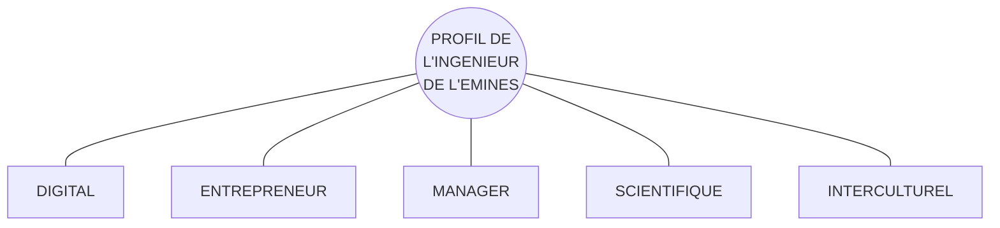

# EMINES
School of Industrial Management

## Cycle Préparatoire Intégré / Cycle Ingénieur

The central portion of the page features a large photograph of a modern building. The structure is made of a reddish-brown, textured material and has a large, deep rectangular recess that houses a multi-paned glass window. This window reflects a clear blue sky with wispy white clouds. At the base of the window, a dark entrance with several doors is visible. The photograph is partially overlaid with stylized geometric patterns: white linear designs on the lower left and dark blue linear designs along the right edge of the page.

**U M 6 P**
University Mohammed VI Polytechnic

# Un Ingénieur en Management Industriel durable au service de l’Afrique

A signing ceremony with several people seated at a long table covered with a red cloth. Sa Majesté le Roi Mohammed VI is present.
Signature de la Convention Université Mohammed VI Polytechnique entre OCP et le Ministère de l’Enseignement Supérieur, en présence de Sa Majesté le Roi Mohammed VI.

> (...) La réforme du système d’éducation se doit non seulement d’assurer l’accès égal et équitable à l’école et à l’université pour tous nos enfants, mais également de leur garantir le droit à un enseignement de qualité, doté d’une forte attractivité et adapté à la vie qui les attend (...)
>
> Discours de Sa Majesté le Roi Mohammed VI, à l’occasion de la dernière commémoration de la Révolution du Roi et du Peuple 20 août 2012.

Sa Majesté le Roi Mohammed VI interacting with students and staff in a laboratory or workshop setting.
Sa Majesté le Roi Mohammed VI a procédé jeudi 12/01/2017 à l’inauguration de l’Université Mohammed VI Polytechnique.

A large, modern, orange-colored building with many windows, part of the UM6P campus.

**L’Afrique est une multitude.** Cet immense continent, berceau de l’humanité, comptant cinquante-quatre états, deux mille langues, mille groupes ethniques, trente millions de kilomètres carrés et une population qui devrait doubler d’ici 2050, est un **espace complexe**, qui doit faire face à des défis majeurs pour consolider sa propre dynamique de développement.

La **révolution numérique** actuelle qui transforme les chaînes de valeur au niveau mondial et le développement des compétences est un de ces défis.

Pour l’Afrique, c’est l’opportunité d’être créatrice **de valeur** dans les industries traditionnelles telles que le secteur manufacturier, mais également dans d’autres secteurs et activités essentiels au développement industriel tels que la logistique, l’agriculture, l’énergie, les communications, les services, la croissance verte et les villes intelligentes.

Le continent africain, fort de son histoire et de son potentiel, dispose d’un ensemble d’atouts majeurs pour inventer son **propre modèle d’industrialisation durable.**

Pour cela, ce continent doit transformer ses modèles d’éducation afin de former les talents qui contribueront à écrire cet avenir. Il doit notamment pouvoir s’appuyer sur des **ingénieurs de haut niveau scientifique, inventifs, créatifs et entrepreneurs** qui sauront conduire le progrès en Afrique.

**L’EMINES - School of Industrial Management a pour vocation de former ces ingénieurs.**
Le profil des ingénieurs de l’EMINES découle logiquement de cette vocation :

Au sein de **l’Université Mohammed 6 Polytechnique (UM6P)**, l’EMINES met ainsi en œuvre deux principes fondateurs de cette université: le **développement des talents au service de l’Afrique** et une pédagogie originale basée sur le **learning by doing**.

**L’EMINES offre ainsi à ses élèves-ingénieurs une formation fondamentale scientifique, technique et socio-économique, marquée par l’excellence académique, appuyée sur un fort développement de savoir-faire pratique et de savoir-être.**

www.emines-ingenieur.org 3

# Une formation d’Ingénieur au service de l’industrialisation durable de l’Afrique ...

## Cycle Préparatoire Intégré 120 ECTS (4 semestres de 30 ECTS – 2 ans)

Les quatre semestres de formation du Cycle Préparatoire Intégré de l’EMINES ont pour objectif d’accroître significativement le niveau des connaissances des bacheliers dans différents champs disciplinaires de manière à les rendre aptes à suivre le Cycle Ingénieur.

### Répartition du volume horaire par matière

<table>
  <tbody>
    <tr>
        <td>Matière</td>
        <td>Pourcentage</td>
    </tr>
    <tr>
        <td>Mathématiques</td>
        <td>23%</td>
    </tr>
    <tr>
        <td>Projet d'Ingénierie</td>
        <td>19%</td>
    </tr>
    <tr>
        <td>Physique Classique</td>
        <td>16%</td>
    </tr>
    <tr>
        <td>Physique Expérimentale</td>
        <td>13%</td>
    </tr>
    <tr>
        <td>Anglais</td>
        <td>10%</td>
    </tr>
    <tr>
        <td>Français</td>
        <td>10%</td>
    </tr>
    <tr>
        <td>Informatique</td>
        <td>6%</td>
    </tr>
    <tr>
        <td>Sport</td>
        <td>3%</td>
    </tr>
  </tbody>
</table>

## Cycle Ingénieur 180 ECTS (6 semestres de 30 ECTS – 3 ans)

La progression pédagogique du Cycle Ingénieur est construite de manière à permettre à chaque élève ingénieur d’acquérir les différentes compétences attendues d’un diplômé de l’EMINES.

<table>
  <thead>
    <tr>
        <th></th>
        <th>Première année</th>
        <th>Deuxième année</th>
        <th>Troisième année</th>
    </tr>
  </thead>
  <tbody>
    <tr>
        <td>SCIENTIFIQUE</td>
        <td>* Calcul Différentiel * Calcul Intégral * Economie Générale * Mécanique * Chimie Industrielle * Thermodynamique Industrielle</td>
        <td>* Probabilités * Statistiques * Data Science*, Mécanique des fluides*, Nanotechnologies*, Cosmologie*, Energie renouvelable*</td>
        <td>* Développement Durable * Etude d'Option (PFE)</td>
    </tr>
    <tr>
        <td>MANAGER</td>
        <td>* Stage d'observation en Géologie * Recherche Opérationnelle * Biomedical engineering * Module d'Initiation au Management Industriel * Description de Controverses</td>
        <td>* Systèmes de Production et Logistique * Evaluation des coûts * Mécatronique * Stratégie minière * Management hospitalier*</td>
        <td>* Stratégie d'entreprise * Droit / Comptabilité / GRH / Achats / Finance d'entreprise * Lean Management * Maintenance industrielle 4.0 * Etude d'Option (PFE)</td>
    </tr>
    <tr>
        <td>DIGITAL</td>
        <td>* Python, Java, SQL, HTML/PHP</td>
        <td>* Analytic Edge * Automatique * Mécatronique * Cryptographie*, Cyber sécurité* * VBA</td>
        <td>* Sureté de fonctionnement* * ERP / SAP® * Etude d'Option (PFE)</td>
    </tr>
    <tr>
        <td>ENTREPRENEUR</td>
        <td>* Acte d'Entreprendre I * Entrepreneurship week</td>
        <td>* Gestion de projet*, Réseaux socio-numériques*, Acte d'Entreprendre II* * Année de césure</td>
        <td>* Business Game * Etude d'Option (PFE)</td>
    </tr>
    <tr>
        <td>INTERCULTUREL</td>
        <td>* Anglais * LV2 (Mandarin / Espagnol) * Sport * Stage d'exécution</td>
        <td>* Anglais * LV2 (Mandarin / Espagnol) * Sport * Shadowing * Mobilité à l'international</td>
        <td>* Développement personnel par le théâtre * Intelligence collective * Préparation à la vie professionnelle * Préparation au TOEIC * Etude d'Option (PFE)</td>
    </tr>
  </tbody>
</table>

**Légende :**
*   <mark style="background-color: #76b82d; color: white;"> Le terrain </mark>
*   <mark style="background-color: #005596; color: white;"> Les cours </mark>
*   <mark style="background-color: #e30613; color: white;"> Les projets </mark>
*   <mark style="background-color: #f39200; color: white;"> Learning by doing </mark>
*   \*: Cours au choix

L’Option va permettre à chaque élève ingénieur de mettre en oeuvre les compétences acquises durant son cursus dans un domaine de son choix, sans pour autant préjuger d’une orientation professionnelle définitive.

L’étude d’option clôture la scolarité et atteste de la compétence d’un élève ingénieur à savoir modéliser un problème complexe en contexte réel et à y apporter une solution innovante avec une mise en oeuvre concrète dans l’entreprise d’accueil.

### Contenu des Options

<table>
  <thead>
    <tr>
        <th>OPTION SUPPLY CHAIN MANAGEMENT</th>
        <th>Contenu</th>
    </tr>
  </thead>
  <tbody>
    <tr>
        <td>Responsable : **Frédéric FONTANE** (Directeur Adjoint Mines ParisTech)</td>
        <td>Semaine 1 : Enjeux industriels et logistiques Semaine 2 : Planification industrielle et gestion de projet Semaine 3 : Maintenance et Qualité Semaine 4 : Prévision des ventes et gestion de stock Semaine 5 : Chaine logistique Semaine 6 : Modeleur et Problem design Semaine 7 : Simulation à événements discrets Semaine 8 : Visites industrielles</td>
    </tr>
  </tbody>
</table>
<table>
  <thead>
    <tr>
        <th>OPTION MINING</th>
        <th>Contenu</th>
    </tr>
  </thead>
  <tbody>
    <tr>
        <td>Responsables : **Damien GOETZ** (Pr. Mines ParisTech) **Ismail AKALAY** (DG. SONASID)</td>
        <td>Semaine 1 : Projets miniers : de la géologie à l'exploitation Semaine 2 : Planification minière Semaine 3 : Mécanique des roches, stabilité et soutènement Semaine 4 : Méthodes de traitement et impacts environnementaux Semaine 5 : Processus achats-logistique-marketing et RSE Semaine 6 : Economie et sélectivité Semaine 7 : Visites industrielles 1 Semaine 8 : Visites industrielles 2</td>
    </tr>
  </tbody>
</table>
<table>
  <thead>
    <tr>
        <th>OPTION DATA SCIENCES INDUSTRIELLES</th>
        <th>Contenu</th>
    </tr>
  </thead>
  <tbody>
    <tr>
        <td>Responsables : **Eric MOULINES** (Pr. Ecole Polytechnique) **Geneviève ROBIN** (Dr. CNRS)</td>
        <td>Semaine 1 : Approfondissement en statistiques, régression linéaire et modèles linéaires généralisés Semaine 2 : Introduction à l'apprentissage supervisé : Arbres de classification et de régression, forêts aléatoires, méthodes ensemblistes, boosting Semaine 3 : Apprentissage non-supervisé : ACP, analyse factorielle, classification hiérarchique, algorithme EM Semaine 4 : Introduction à l'apprentissage profond Semaine 5 : Machines à vecteurs de support et méthodes à noyaux Semaine 6 : Introduction au traitement des langues naturelles Semaine 7 : Data Analytics pour les processus industriels Semaine 8 : Datacamp</td>
    </tr>
  </tbody>
</table>
<table>
  <thead>
    <tr>
        <th>OPTION MANAGEMENT DES ENTREPRISES INNOVANTES</th>
        <th>Contenu</th>
    </tr>
  </thead>
  <tbody>
    <tr>
        <td>Responsables : **Michel BERRY** (Ecole de Paris du Management) **Christophe DESHAYES** (Ecole de Paris du Management)</td>
        <td>Semaine 1 : Introduction au management, aux outils de gestion, aux technologies invisibles et aux modes managériales (Prise de recul) Semaine 2 : Management de l'innovation Semaine 3 : Gestion de projets complexes et innovants Semaine 4 : Entrepreneuriat – Entrepreneuriat social - Intrapreneuriat Semaine 5 : Transformation numérique et logique de plateforme Semaine 6 : Transition écologique et financement Semaine 7 : Libération des énergies – Management de proximité Semaine 8 : Gestion de l'extrême</td>
    </tr>
  </tbody>
</table>

4    www.emines-ingenieur.org    www.emines-ingenieur.org    5

... bénéficiant d’une pédagogie par projet en lien étroit avec le monde industriel ...

# Les projets

* **Cycle préparatoire intégré**
    * Projet d’Ingénierie « construction de robots »
    * Projet de Physique expérimentale

* **1ère année du cycle ingénieur**
    * Initiation au Management Industriel (par groupe de 10)
    * Acte d’Entreprendre (individuel ou en groupe)
    * Controverse (par groupe de 5)
    * Informatique (Client réel)
    * Mini-projet d’entrepreneuriat
    * Mini-projet de mécanique
    * Mini-projet d’économie

* **2ème année du cycle ingénieur**
    * Projet mécatronique (par groupe de 10)
    * Projet de statistiques (par groupe de 3)
    * Mini-projet d’automatique

* **3ème année du cycle ingénieur**
    * Jeu d’entreprise
    * Projets d’option (selon l’option choisie)

# Immersion terrain

* **1ère année du Cycle Ingénieur**
    * Stage ouvrier (4 semaines en entreprise)
    * Visites industrielles d’Initiation au Management Industriel (1 semaine de visites)
    * Stage d’observation en géologie (1 semaine de terrain)

* **2ème année du cycle ingénieur**
    * Stage de shadowing (1 semaine en entreprise)
    * Mobilité à l’international d’initiation à la recherche (12 à 16 semaines en laboratoire académique ou industriel à l’étranger)

* **3ème année du cycle ingénieur**
    * Visites industrielles d’option (1 à 3 semaines de terrain selon l’option choisie)
    * Etude d’option (24 semaines en entreprise + 1 semaine de restitution)

# Les liens avec le monde de la recherche

* Stage de 12 à 16 semaines dans une université ou un laboratoire de recherche industrielle à l’étranger (entre la 2ème et la 3ème année du cycle ingénieur)
* Projets immergés dans les laboratoires de recherche OCP Africa ORANO OCP de l’Ecole et de l’UM6P, et/ou en lien avec les plates-formes technologiques de l’UM6P, Green Energy Park, Green Building Park, Ferme Expérimentale
* Majorité des enseignants issus du monde de la recherche académique ou industrielle

> * **Au moins 42 semaines** de terrain, principalement en entreprise, pour tous les élèves
> * **dont minimum 3 mois** à l’étranger pour tous les élèves
> * **forte implication industrielle** assurant ainsi une réelle actualité des enseignements.

# Mobilité à l’international en 2ème année ingénieur

L'image montre une carte du monde avec plusieurs points verts localisant les destinations de mobilité internationale en Amérique du Nord, en Europe, en Afrique et en Asie.

# Exemples d’étude d’option

<table>
  <thead>
    <tr>
        <th>Option Supply Chain Management</th>
        <th>Option Supply Chain Management</th>
        <th>Option Data Sciences Industrielles</th>
    </tr>
  </thead>
  <tbody>
    <tr>
        <td>JAQIR SOUFIANE Promotion 2019  ISMAIL AIT OUAHMANE Promotion 2019</td>
        <td>OUMAIMA FASLI Promotion 2019</td>
        <td>YOUSSEF FAOUZI Promotion 2021</td>
    </tr>
    <tr>
        <td>**Nouvelle stratégies pour améliorer la supply chain des fertilisants en Ethiopie**</td>
        <td>**Planification de la phase finale de l’exploitation de la mine de Cominak**</td>
        <td>**Modélisation et implémentation d’une solution de prédiction du taux de perte pour la clientèle Particuliers Résident**</td>
    </tr>
    <tr>
        <td>**OCP Africa**</td>
        <td>**ORANO**</td>
        <td>**BCP**</td>
    </tr>
    <tr>
        <td>Elaboration de schémas directeurs logistiques pour approvisionner en engrais les agriculteurs éthiopiens et comparaison de ces scénarios en fonction du coût, de la disponibilité produits et de l’empreinte environnementale.</td>
        <td>Détermination des conditions pour exploiter des stots riches en uranium en réalisant, d’une part, une étude géotechnique pour caractériser les conditions géométriques et géo-mécaniques de leur exploitation, et, d’autre part, une définition de l’organisation pour planifier cette extraction.</td>
        <td>Développement d’un outil de prédiction du taux de perte de la clientèle en utilisant des données, issues du datawarehouse de la banque, concernant les informations des clients et l’historique de leurs opérations bancaires.</td>
    </tr>
  </tbody>
</table>

6    www.emines-ingenieur.org    www.emines-ingenieur.org    7

... dans une Ecole ouverte sur le monde ...

A photograph of a young man looking through a glass surface with mathematical or scientific notations written on it.

## Les langues

*   L'apprentissage des langues s'appuie sur le Language Lab de l'UM6P. Ce dernier mobilise des méthodes pédagogiques originales et variées (théâtre, debating, Model United Nations, ...).
*   Anglais, outil de travail pour tous.
*   Français en cycle préparatoire intégré.
*   Chinois ou Espagnol au choix dans le cycle ingénieur.

## L'étranger

*   La mobilité de fin de 2ème année est volontairement orienté vers les pays à forte croissance, avenir du développement mondial et futurs partenaires économiques majeurs du Maroc : Brésil, Singapour, Mexique, Chine, Malaisie ...
*   Voyages d'option (pour certaines options) à l'étranger.

## Partenariat privilégié avec l'Ecole des Mines de Paris

*   Nombreux enseignants issus de l'Ecole des Mines de Paris.
*   Supports pédagogiques communs.
*   Activités de recherche liées.
*   Encadrement d'option.

## Autres partenaires universitaires

*   Partenariat de recherche et d'enseignement avec plusieurs enseignants de l'Ecole Polytechnique et du MIT.
*   Partenaires divers en Amérique Latine et Asie du Sud-Est pour la mobilité internationale.

## Recherche orientée vers l'industrie

*   PhD « industriel » : réalisation d'une thèse sur une problématique de recherche en management industriel d'une entreprise, encadrée par un professeur de l'EMINES.
*   Encadrement de recherche : recours à l'expertise des professeurs internationaux affiliés à l'EMINES sur la gestion industrielle et logistique, l'économie des matières premières, les data sciences et la modélisation.

8    www.emines-ingenieur.org    www.emines-ingenieur.org    9

... au cœur de l’UM6P ...

# Université Mohammed VI Polytechnique

L’UM6P est une open university, au service de la recherche et de l’éducation pour l’Afrique. Elle a pour objectif de

## DÉFIS AFRICAINS

*   Gestion rationnelle des ressources naturelles
*   Développement du Capital Humain
*   Industrialisation durable
*   Politiques publiques agiles

## SUJETS DE RECHERCHE

*   Water, Agriculture & Environment
*   Natural Resources & Food Security
*   Renewable Energy
*   Industrial & Chemical Engineering
*   Biotechnology & Biomedical Engineering
*   Architecture, Urban Planning & Land Use
*   Geology and Sustainable mining
*   Agricultural Economics & Development
*   Chemical and Bio-chemical / Green Process Engineering
*   Complex system engineering and Human Sciences
*   Behavioral Sciences
*   Computer & Communication Scientist
*   Medical Application Interfae
*   Industrial Economy and emerging Africa

Cette université de nouvelle génération se situe au coeur de la **Ville Verte Mohammed VI**, qui est un projet modèle d’inovation urbaine conçu autour du savoir, de l’inovation et de la durabilité.

Chiffres projetés :

<table>
  <tbody>
    <tr>
        <td>1000 Ha (Map icon)</td>
        <td>100.000 Inhabitants</td>
        <td>25.000 Residential units</td>
        <td>80 Ha Green Promenade</td>
    </tr>
    <tr>
        <td>20 m² Green spaces per inhabitant</td>
        <td>50 Ha Tertiary</td>
        <td>6.000 Students &amp; researchers</td>
        <td>200.000 m² GLA of commerce</td>
    </tr>
  </tbody>
</table>

The image shows a wide-angle view of a modern university building courtyard with a large, white, geometric canopy structure. Students are seen walking and sitting in the open area, which features orange bean bags and modern architectural elements.

## LES CONDITIONS DE VIE

The image shows a group of seven students lying on green grass in a circle, their heads towards the center, looking up and smiling at the camera.

*   Frais de scolarité et de logement – visitez notre site internet www.emines-ingenieur.org
*   Possibilité de **Bourses d’Excellence** couvrant totalement ou partiellement les frais de scolarité.
*   Possibilité de **Bourses de Vie** sous conditions de ressources couvrant totalement ou partiellement les frais de scolarité, de logement et de nourriture.

## Vie associative

*   Bureau Des Elèves
*   Bureau Des Sports
*   Bureau Des Arts (Musique, Danse, Théâtre, Dessin, Photo et Vidéo)
*   EMINES Technology (E-Tech, EMINES Solar Car, E-Social Entrepreneurship)
*   E-Solidarity (E-Olives, Caravane du sourire, Soutien scolaire)
*   E-Junior Entreprise, Great debaters, MUN, E-Astro, …

## Hébergement et restauration

*   Les résidences étudiantes affectée à l’EMINES comptent 300 chambres
*   Cafétéria et restaurant universitaires.

## Le sport

*   Les installations sportives de l’UM6P ont été particulièrement soignées. Ainsi, une piscine couverte, 6 terrains multisport, une salle de musculation et une salle de cardio ont été construits.
*   L’école est également membre du Cartel des Mines, association réunissant une fois par an les étudiants sportifs des Ecoles des Mines françaises, espagnoles, allemandes, italiennes, anglaises et russes.
*   Enfin, l’ecole participe aux différentes compétitions et tournois universitaires Marocains.

## Accessibilité et transports

The image shows a student sitting on a bed in a modern dormitory room, looking at a smartphone. The room has a desk with a laptop and a window.

*   Ben Guerir se situe à 1 heure de Marrakech et bénéficie ainsi de la proximité avec cette grande ville et les autres universités qui s’y trouvent.
*   De plus, l’EMINES est facilement accessible par autoroute et par train. Les aéroports de Marrakech et Casablanca se trouvent aussi à proximité.

10 www.emines-ingenieur.org
www.emines-ingenieur.org 11

... permettant une vie étudiante de qualité et des perspectives d’avenir.

The page features a large aerial view of the University Mohammed VI Polytechnic campus, showing modern buildings, green spaces, and various facilities. Key locations are labeled:

*   UNIVERSITY MOHAMMED VI POLYTECHNIC
*   Station M
*   Green & SMART Building Park
*   Datacenter
*   Teleport
*   Green Energy Park

Below the main image are two smaller photographs:
*   On the left, a group of students is seen walking along a tree-lined path on campus.
*   On the right, students are shown in a modern, well-lit indoor common area or lounge, engaged in conversation and study.

# Témoignages de lauréats (Que retiens-tu de ton parcours à l’EMINES ?)

[Portrait of Wassila BOUGUEJJA]
> « Tout sauf monotone ! J’en ressors armée par des compétences fondamentales, grandie car entourée et formée par des personnes aussi compétentes qu’humbles et ouverte à toute sorte d’expériences ! A défaut d’avoir développé une expertise précise, on m’a permis d’avoir une vision complète du monde professionnel de demain et d’être aux aguets des nouvelles innovations »
**Wassila BOUGUEJJA** – 1er Poste : Consultante en stratégie, BCG, Casablanca, Maroc

[Portrait of Mehdi CHERGUI]
> « Un parcours très riche, mais surtout unique. Car durant ces quelques années, EMINES et moi, nous avons grandi ensemble ! J’ai eu l’opportunité de développer mes compétences techniques mais surtout mes soft skills ce qui est essentiel dans la réussite des missions professionnelles que je mène actuellement »
**Mehdi CHERGUI** – 1er Poste : Chef de projet d’excellence opérationnelle & amélioration continue, TOTAL, Dakar, Sénégal

[Portrait of Carl Josué TALI ATOUNDOU]
> « À mon arrivée à l’EMINES, au Maroc, je ne m’attendais pas à kiffer autant ma vie universitaire. De par sa formation qui cible l’ingénieur, le manager, mais aussi l’humain, l’école m’a permis de découvrir une meilleure version de moi-même. Pendant ces 5 années, j’ai évolué dans un environnement qui m’a permis d’exploiter au mieux mes talents dans différentes disciplines d’enseignement (projet d’ingénierie, informatique, mécatronique, physique expérimentale, ...) parmi lesquels je me suis découvert une passion pour l’entrepreneuriat.
>
> Cette passion naissante fut d’ailleurs l’objet de mon projet de fin d’études. En effet, ce dernier consistait à réaliser une étude de préfaisabilité de la création d’une entreprise technologique pour une solution de réfrigération sans électricité et sans eau. Avec 3 de mes camarades de promotion, nous avons passé 6 mois de travail acharné sur ce projet dont les résultats nous ont permis d’obtenir un financement de la part de l’UM6P afin de créer notre startup : BMTA & C.
>
> Aujourd’hui encore, je vis cette passion chaque jour en travaillant comme entrepreneur sur notre projet de réfrigération sans électricité et sans eau, avec pour objectif d’impacter l’Afrique, plus généralement le monde, à travers l’innovation »
**Carl Josué TALI ATOUNDOU** – 1er Poste : Co créateur de la start up BMTA & C, Ben Guérir, Maroc

[Portrait of Latifa BOUSSAADI]
> « Les trois années que j’ai passées à l’EMINES ont été sans doute très riches en matière d’apprentissage sur tous les niveaux : sciences dures (maths, physiques), programmation, recherche opérationnelle, gestion projets et communication. J’ai eu la chance d’avoir des cours très variés, et cette diversité m’a surtout permis de me développer et d’être suffisamment outillée pour s’adapter rapidement à n’importe quelle situation qui peut se présenter dans mon quotidien professionnel. L’ensemble de ces compétences me sont fort utiles pour conduire les missions de mon équipe au sein du département Supply Chain & Performance du site Jorf Lasfar du groupe OCP. Comme nous devons assurer une optimisation globale et continue des activités du site en se coordonnant avec les entités corporate, le commercial et le Business Steering, la flexibilité, la rigueur, la proactivité et l’agilité sont des capacités essentielles que j’ai acquises à l’EMINES »
**Latifa BOUSSAADI** – 1er Poste : Supply Chain Planning Engineer, OCP, El Jadida, Maroc

<page_footer>
www.emines-ingenieur.org    13
</page_footer>

12    www.emines-ingenieur.org

Les objectifs de l'EMINES en chiffres

# EFFECTIFS VISÉS

*   **35 élèves** par promotion (en 1ère et 2ème années du cycle préparatoire intégré)
*   **70 élèves** par promotion (en 1ère, 2ème et 3ème années du cycle ingénieur)

---

# COMMENT ENTRER À L'EMINES ?
www.emines-ingenieur.org

*   **En cycle préparatoire intégré**
    *   Admission sur concours EMINES
        - Elèves titulaires du Baccalauréat Scientifique - 35 places

*   **En cycle ingénieur**
    *   Admission sur concours EMINES
        - Elèves de classes préparatoires scientifiques (MP, PSI, TSI), ou équivalent étranger - 35 places

The image shows a group of five students walking and talking in a modern, brightly lit university hallway. On the left wall, there is a large digital screen displaying a building and the time "Mardi 17 16:32". The students are dressed in casual attire, carrying books and folders.

14    www.emines-ingenieur.org    www.emines-ingenieur.org    15

# EMINES
## School of Industrial Management

### UNIVERSITÉ MOHAMMED VI POLYTECHNIQUE

contact@emines-ingenieur.org
www.emines-ingenieur.org