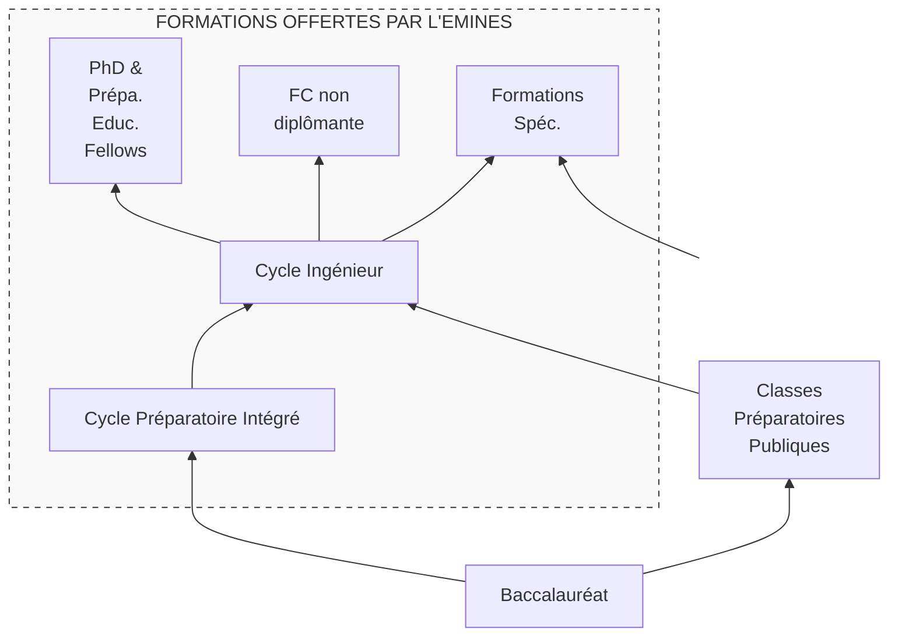

EMINES
School of Industrial Management
UNIVERSITÉ MOHAMMED VI POLYTECHNIQUE

# Formation Ingénieur

## EMINES – School of Industrial Management

### Eléments d’information

-

#### Juin 2025

UM6P
University Mohammed VI Polytechnic

EMINES – Informations Admis – Juin 2025

# LES ATOUTS DE L’EMINES........................................................................................................................ 2
# L’EMINES – School of Industrial Management........................................................................................ 3
## Pourquoi une Ecole dédiée au Management Industriel au Maroc ?................................................... 3
## Missions de l’Ecole .............................................................................................................................. 4
## Positionnement et Stratégie ............................................................................................................... 4
## Formation et Recherche...................................................................................................................... 6
## Partenariats et International ............................................................................................................... 7
## Organisation et Moyens ...................................................................................................................... 8
# LE CYCLE PREPARATOIRE INTEGRE.......................................................................................................... 9
## Le programme du CPI .......................................................................................................................... 9
## Les enseignants du CPI ...................................................................................................................... 10
## Les projets du CPI .............................................................................................................................. 10
# LE CYCLE INGENIEUR ............................................................................................................................. 12
## Le programme du CI .......................................................................................................................... 12
## Les enseignants du CI ........................................................................................................................ 13
## Les stages et la mobilité internationale ............................................................................................ 15
## Les projets du CI ................................................................................................................................ 16
# LA VIE ETUDIANTE ................................................................................................................................. 17
# SUIVI DES LAUREATS ET EMPLOI ........................................................................................................... 19
## Les statistiques d’emploi ................................................................................................................... 19
## Les employeurs.................................................................................................................................. 20
## Les start-up issues de l’EMINES......................................................................................................... 21
## Les formations complémentaires de nos diplômés .......................................................................... 21
## Les salaires des diplômés .................................................................................................................. 22

The image shows the EMINES building during its construction in 2013. It is a large, multi-story concrete structure with visible scaffolding. Construction equipment, including a crane and a concrete mixer truck, is present on the site under a cloudy sky.

**Bâtiment EMINES pendant sa construction en 2013, quelques mois avant son ouverture.**

1

EMINES – Informations Admis – Juin 2025

# LES ATOUTS DE L’EMINES

* Caractère unique de l’offre de formation de Managers Industriels au Maroc, et plus largement en Afrique (combinant les disciplines scientifiques, le monde du digital, de la robotique et des data sciences, le management, l’entrepreneuriat et le développement personnel).
* Adéquation des formations à la demande du monde du travail et aux évolutions de cette demande, avec une mention particulière sur les qualités d’adaptation des diplômés.
* Insertion professionnelle (principal critère de performance de l’Ecole) excellente au Maroc comme à l’étranger, avec des retours très positifs de l’ensemble des entreprises ou organismes qui recrutent les diplômés de l’Ecole.
* Formations aptes à faire émerger le « talent entrepreneurial » des étudiants avec 6 start-up actives qui vivent de leur travail et commencent à créer de l’emploi.
* Diplômés admis dans des formations complémentaires à l’étranger parmi les plus sélectives.
* Deux concours d’entrée très sélectifs et rigoureux, qui s’attachent à détecter le potentiel des candidats et ne comportent aucune barrière linguistique.
* Corps enseignant originaire des meilleures institutions d’enseignement supérieur internationales, et du monde de l’entreprise.
* Développement de « l’individu élève », géré comme un adulte responsable, placé au cœur du dispositif de formation, et acteur à part entière du développement de l’Ecole.
* Méthodes pédagogiques, et en particulier « Learning by Doing », très originales présentes dans toutes les disciplines, dès les classes préparatoires intégrées.
* Prise en charge des étudiants issus de milieux moins favorisés par un système de bourses sociales permettant une réelle mixité sociale à l’Ecole.
* Richesse de l’environnement UM6P sous toutes ses facettes, qui offre de nombreuses opportunités de développer son réseau, d’être confronté à d’autres profils, d’accéder aux enseignants des autres établissements, etc ...

The image shows a modern, rectangular building with a reddish-brown facade, featuring vertical window slits and a grassy area in front under a blue sky.

**Bâtiment EMINES aujourd’hui, après 12 années d’existence et 8 promotions diplômées.**

2

EMINES – Informations Admis – Juin 2025

# L’EMINES – School of Industrial Management

## Pourquoi une Ecole dédiée au Management Industriel au Maroc ?

Tout au long du XXème siècle, les établissements d’enseignement supérieur d’ingénierie nationaux et internationaux ont formé des diplômés plus ou moins spécialisés pour résoudre les questions essentiellement techniques posées au monde des entreprises. Leurs programmes de recherche suivaient cette direction, en consacrant l’essentiel de leurs efforts au développement de modèles scientifiques aptes à aider à la mise en place de ces solutions techniques.

En ce début de XXIème siècle, le besoin a très sensiblement évolué avec la mondialisation des marchés, avec l’évolution de plus en plus rapide à la fois des solutions techniques disponibles (en particulier digitales) et des systèmes organisationnels dans l’entreprise, et avec la démocratisation de l’accès à l’information et aux formations numériques. Le besoin d’ingénieurs (au sens de « cadres maîtrisant les techniques de leur spécialisation ») est désormais complété d’un besoin de « managers industriels » capables d’appréhender à la fois le caractère global des entreprises industrielles et les différentes composantes (économique, sociale, environnementale) de leur fonction. De même, les travaux de recherche ont dû, pour embrasser la globalité des questions posées, s’intéresser à de nouveaux sujets, profondément multidisciplinaires, et très proches des réalités d’application. L’émergence des projets industriels qui associent des pays du Sud (projet de pipe reliant le Maroc et le Nigéria par exemple) est en outre venu renforcer cette nécessaire prise en compte de la réalité, repoussant l’utilisation de « solutions catalogues » importées des pays du Nord et désormais inadaptées.

De plus, l’Afrique, dans sa multitude, doit répondre aux défis de la révolution numérique actuelle et de la transition énergétique qui transforment les chaînes de valeur au niveau mondial. Pour que ces évolutions majeures soient créatrices de valeur dans les industries traditionnelles telles que le secteur manufacturier, mais également dans d’autres secteurs essentiels au développement industriel tels que la logistique, l’agriculture, l’énergie, les communications, les services, la croissance verte et les villes intelligentes, le continent Africain doit disposer des compétences pour conduire ces changements. Pour cela, ce continent doit transformer ses modèles d’éducation et de recherche afin de former les talents qui contribueront à écrire cet avenir.

C’est dans ce contexte que l’EMINES - School of Industrial Management, première pierre de l’Université Mohammed VI Polytechnique, a été créée, avec pour mission de développer des programmes de formation et de recherche dans le domaine du management industriel, pour alimenter les entreprises existantes ou à créer, dans un esprit qui doit rester très proche de la pratique et du concret, et des réalités d’un environnement économique changeant et multiculturel.

L’EMINES a bénéficié pour cela de la proximité qu’elle a développé d’abord avec le groupe OCP puis avec le monde des entreprises marocaines, et plus largement des entreprises installées en Afrique. L’EMINES assoit ainsi ses programmes de formation et recherche sur un fort partenariat industriel, et offre à ses futurs diplômés des formations fondamentales scientifiques, techniques et socio-économiques solides, appuyées sur un fort développement de savoir-faire pratiques et de savoir-être entrepreneuriaux dans les différents domaines d’application du management industriel. Elle les prépare à devenir les futurs managers industriels du Maroc et du continent, créateurs de valeurs scientifiques, techniques, économiques et organisationnelles.

3

EMINES – Informations Admis – Juin 2025

# Missions de l’Ecole

Le développement de l’EMINES s’inscrit directement dans le projet de l’Université Mohammed VI Polytechnique, dont la vision peut se résumer comme suit :

* Devenir une Université de rang international, qui cherche à répondre aux enjeux du continent Africain que sont :
    - la gestion rationnelle des ressources,
    - l’industrialisation durable,
    - l’amélioration des politiques publiques,
    - le développement du capital humain,
* Qui donne la priorité à la recherche, l’innovation et l’entrepreneuriat pour la formation des futurs leaders socialement responsables de l’Afrique,
* Qui appuie son développement sur des partenariats académiques nationaux, et internationaux « en Afrique et pour l’Afrique »,
* Dans une structure à gestion privée, bénéficiant d’un Partenariat Public Privé, à but non lucratif et socialement juste.

Dans ce cadre, l’EMINES s’intéresse plus spécifiquement au thème « industrialisation durable », dans lequel elle a pour mission ou vocation première de **répondre aux enjeux de management de projets industriels d'entreprises (existantes ou à créer) dans l'environnement complexe de l’industrialisation durable de l’Afrique.**

Une mission ou vocation complémentaire, confiée à l’Ecole par l’Université, est de **préparer un corps enseignant en sciences de base** (mathématiques, physique et chimie, et sciences industrielles de l’ingénieur) pour les besoins propres de l’Université qui a fait le choix de former son personnel enseignants chercheurs, et plus largement pour les établissements d’enseignement d’excellence du pays et du continent.

> ***Pourquoi industrialiser le continent Africain ?***
>
> *L’Afrique produit seulement 1% de la valeur ajoutée manufacturière mondiale et donc importe massivement les produits manufacturés. Il y a là un champ de croissance énorme pour le continent, qui doit aller vers la transformation locale de ses matières premières (minérales ou agricoles).*
>
> *C’est en effet au niveau de cette transformation (c’est-à-dire de l’industrialisation) que se crée la valeur.*
>
> *A titre d’exemple, la Côte d’Ivoire et le Ghana, qui produisent à eux deux 60% du cacao mondial, ne reçoivent pour cela que 6% des recettes mondiales générées par le chocolat (estimées à 100 milliards de US $), car il n’y a pas d’industrie de transformation locale du cacao.*

## Positionnement et Stratégie

Pour accomplir ses missions, et respecter l’excellence internationale attendue par l’Université, l’Ecole est confrontée aux enjeux principaux (qui constituent aussi ses principaux indicateurs de performance) suivants :

4

EMINES – Informations Admis – Juin 2025

* montrer aux candidats que l’EMINES est une meilleure Ecole (à la fois en termes de contenus et en termes de débouchés et de salaires à la sortie) que la plupart de celles qu’ils vont trouver à l’étranger ;
* montrer aux employeurs, nationaux comme internationaux, que les produits de l’Ecole (ses diplômés et ses programmes de formation continue et de recherche) sont dotés des qualités qu’ils vont habituellement rechercher dans les pays du Nord ;
* permettre à ceux de ses étudiants qui ont une vocation entrepreneuriale de développer et lancer leur activité, dans des conditions de risque et de financement acceptables.

Son positionnement privilégie d’une part **l’excellence**, qui se traduit par la priorité donnée à la qualité de ses étudiants plutôt qu’à leur quantité et par des concours d’entrée très sélectifs tout en restant socialement justes, et d’autre part le développement de solutions d’enseignement et de recherche « **sur mesure** » adaptées aux réalités des entreprises du XXIème siècle, qui se traduit par une priorité donnée au terrain et à la pratique dans ses formations et ses recherches.

La stratégie de développement de l’Ecole peut alors être déclinée comme suit :

* Former, pour les entreprises du monde entier, des managers industriels généralistes, capables de penser « out of the box » et de créer de la valeur, et donc :
    - disposant d’un large socle de compétences disciplinaires et de soft skills renforcés,
    - « parlant couramment » informatique, robotique, data sciences,
    - familiarisés à la pratique et au concret du terrain industriel,
    - capables d’appréhender la complexité du monde (et en particulier du Sud) et des cultures d’entreprise, et la dimension internationale et multiculturelle des projets industriels,
    - préparés à apprendre à apprendre, afin d’être adaptés à l’évolution rapide des technologies et des organisations.
  A partir de tous les viviers de candidats possibles (i.e. sélectionnés par concours au niveau Bac pour le Cycle Préparatoire Intégré de l’Ecole, Bac +2 après CPGE pour le Cycle Ingénieur, Bac +5 après un diplôme d’Ingénieur pour le PhD et les Mastères Spécialisés, et tout au long de la vie pour les Formations Continues et les Executive Masters).

* Former un corps enseignant en sciences de base (mathématiques, physique et chimie, et sciences industrielles de l’ingénieur) combinant le niveau scientifique attendu des meilleurs agrégés et les qualités pédagogiques recherchées dans l’enseignement supérieur de rang international, à partir de candidats sélectionnés au niveau Bac +5 sur critères d’excellence (en particulier lors de leurs deux premières années de formation post-Bac).

* Accompagner le développement personnel des étudiants pour susciter et assister les vocations entrepreneuriales pendant la scolarité (undergraduate, graduate et formation professionnelle) dans un esprit de pré-incubation.

* Etudier les organisations industrielles et leurs processus de production (physiques, informationnels et/ou de prise de décision) dans une approche systémique de la supply chain, afin de créer des solutions de recherche innovantes adaptées à la réalité quotidienne des entreprises du Sud.

5

EMINES – Informations Admis – Juin 2025

# Formation et Recherche

L’EMINES anime les programmes de formation suivants :

*   Cycle Préparatoire Intégré en Management Industriel (depuis oct. 2013) - Autorisation n° 02/1528 du 03/06/2015 - Accréditations n° 02/1626 du 23/06/2015, n°04/2621 du 13/12/2018, et n° 2066/04 du 19/10/2023
*   Cycle Ingénieur en Management Industriel (depuis sept. 2014) - Autorisation n° 02/1528 du 03/06/2015 - Accréditation n° 02/1626 du 23/06/2015, n°04/2621 du 13/12/2018 et n° 2066/04 du 19/10/2023
*   Programme PhD Industriel (depuis nov. 2013)
*   Préparation Education Fellow (Agrégation) (depuis sept. 2019) – Options Mathématiques, Physique Chimie, Sciences Industrielles de l’Ingénieur
*   Formations Continues non diplômantes (depuis janv. 2018)
*   Executive Master en Supply Chain de l’Eau (depuis janv. 2020)
*   Executive Master en Posture et Outil du Manager Industriel (depuis mars 2023)

<table>
  <thead>
    <tr>
        <th>Effectifs Etudiants</th>
        <th>2013-2014</th>
        <th>2014-2015</th>
        <th>2015-2016</th>
        <th>2016-2017</th>
        <th>2017-2018</th>
        <th>2018-2019</th>
        <th>2019-2020</th>
        <th>2020-2021</th>
        <th>2021-2022</th>
        <th>2022-2023</th>
        <th>2023-2024</th>
        <th>2024-2025</th>
    </tr>
  </thead>
  <tbody>
    <tr>
        <td>Cycle préparatoire Intégré</td>
        <td>33</td>
        <td>62</td>
        <td>74</td>
        <td>59</td>
        <td>58</td>
        <td>75</td>
        <td>68</td>
        <td>67</td>
        <td>51</td>
        <td>63</td>
        <td>79</td>
        <td>72</td>
    </tr>
    <tr>
        <td>Cycle Ingénieur</td>
        <td>-</td>
        <td>13</td>
        <td>50</td>
        <td>97</td>
        <td>132</td>
        <td>140</td>
        <td>132</td>
        <td>174</td>
        <td>178</td>
        <td>188</td>
        <td>185</td>
        <td>204</td>
    </tr>
    <tr>
        <td>PhD (Doctorants) et Prépa Educ Fellow (Agrégation)</td>
        <td>2</td>
        <td>4</td>
        <td>6</td>
        <td>13</td>
        <td>22</td>
        <td>21</td>
        <td>37</td>
        <td>43</td>
        <td>36</td>
        <td>36</td>
        <td>27</td>
        <td>23</td>
    </tr>
    <tr>
        <td>Form. Executive diplômante</td>
        <td>-</td>
        <td>-</td>
        <td>6</td>
        <td>4</td>
        <td>9</td>
        <td>-</td>
        <td>7</td>
        <td>19</td>
        <td>12</td>
        <td>12</td>
        <td>30</td>
        <td>144</td>
    </tr>
    <tr>
        <td>TOTAL</td>
        <td>35</td>
        <td>79</td>
        <td>136</td>
        <td>173</td>
        <td>221</td>
        <td>236</td>
        <td>244</td>
        <td>303</td>
        <td>277</td>
        <td>299</td>
        <td>321</td>
        <td>443</td>
    </tr>
  </tbody>
</table>
**Historique de l’effectif étudiant de l’EMINES depuis sa création**

Les activités de recherche de l’Ecole sont structurées autour de :

*   la formation des étudiants en PhD (composée d’une année préparatoire de formation et d’initiation à la recherche, suivie par 3 années de doctorats dans le cadre du CEDoc de l’UM6P),
*   et de l’équipe de recherche en Management Industriel, qui s’appuie sur les Faculties recherche de l’EMINES et sur une dizaine de Pr. Affiliés recherche.

Les outils de recherche utilisés à l’Ecole sont principalement des outils d’optimisation, de simulation et de data sciences.

6

EMINES – Informations Admis – Juin 2025

## Partenariats et International

Le développement de l’Ecole s’appuie sur différents partenariats académiques internationaux :

* Pour la formation, l’Ecole bénéficie depuis sa création d’un partenariat privilégié avec l’Ecole des Mines de Paris (Mines Paris - PSL) avec lequel elle partage une option du cycle ingénieur (qui conduit une dizaine d’étudiants européens à passer quelques semaines chaque année avec les étudiants de l’Ecole), une Chaire d’enseignement et de recherche en Ressources Minérales pour la Transition Energétique, et un accès aux enseignants et aux supports pédagogiques. Elle s’appuie en outre sur une autre Chaire d’enseignement et de recherche en Data Sciences Industrielles passée avec l’Ecole Polytechnique pour l’animation d’une autre option du Cycle Ingénieur. L’Ecole utilise aussi le réseau international développé par l’Université, et en particulier aux Etats-Unis.

* Pour offrir à ses étudiants des mobilités de recherche à l’étranger (activité pédagogique obligatoire dans le Cycle Ingénieur), l’Ecole a développé une série de partenariats avec des Universités d’Amérique latine et d’Asie qui permettent d’envoyer chaque année l’ensemble des étudiants de 2ème année ingénieur en mobilité internationale pendant 3 à 4 mois. L’Ecole prend en charge directement les coûts liés de ces stages, ce qui est directement justifié par la stratégie de l’Ecole, qui veut proposer aux employeurs des diplômés ayant les mêmes compétences que celles de diplômés formés à l’étranger.

* Pour le recrutement de ses étudiants sub-sahariens, l’Ecole s’appuie sur un partenariat avec l’IPGEI à Nouakchott en Mauritanie, et sur le partenariat de l’Université avec l’INP-HB à Yamoussoukro en Côte d’Ivoire.

* Pour ses activités de recherche, l’Ecole s’appuie sur ses partenariats en France avec le réseau universitaire constitué par ses Pr. Affiliés recherche (Paris Dauphine, Paris II, Université d’Auvergne, Université de Nantes, Mines Paris – PSL, et Ecole Polytechnique en particulier), pour accompagner la formation doctorale et post-doctorale.

* L’Ecole utilise enfin pleinement son réseau de relations entreprises pour enrichir ses formations, avec des intervenants du groupe OCP, de SONASID, des projets co-animés avec RATP Dev, des modules co-construits avec Jesa, etc …

Une carte du monde illustre l'étendue mondiale des partenariats de l'UM6P, avec de nombreux logos d'institutions partenaires répartis sur tous les continents : Amérique du Nord, Amérique du Sud, Europe, Afrique, Asie et Océanie.

**Les principaux établissements partenaires de l’UM6P**

7

EMINES – Informations Admis – Juin 2025

## Organisation et Moyens

L’EMINES a été créée en 2013 en tant qu’établissement relevant de l’Université Mohammed VI Polytechnique (UM6P) et a bénéficié de l’autorisation n° 404/13 du 28/11/2014. Elle est installée à Ben Guerir, dans la province de Rehamna, au siège de l’UM6P.

L’Ecole est structurée en unités académiques et en services fonctionnels. Elle appuie en outre son fonctionnement sur les organes internes suivants :

*   Comité Pédagogique, en charge de la validation et du suivi des programmes de formation, de l’évaluation des enseignements, et de la validation des recrutements des enseignants ;
*   Comité de la Recherche, en charge des questions relatives à la formation et au suivi des étudiants en PhD (doctorants) et aux programmes de recherche ;
*   Comité des Etudes, en charge de l’admission, du suivi et de la sanction des Etudes ;
*   Jurys de concours pour chaque programme, placés auprès du Comités des Etudes ;
*   Commission des Bourses (des bourses sociales et bourses d’Excellence) ;
*   Conseil d’Etablissement, en charge de la validation des orientations stratégiques de l’Ecole.

Les étudiants y sont représentés à la fois dans le Comité Pédagogique, dans le Comité des Etudes tant que de besoin, et dans le Conseil d’Etablissement.

Le personnel en charge de la formation, de la recherche, et plus largement du fonctionnement de l’établissement est composé d’un corps académique réunissant 58 enseignants responsables + environ 50 intervenants ponctuels, et 24 personnels techniques et administratifs.

Le bâtiment occupé par l’EMINES comprend 4 amphithéâtres, 40 salles de cours, 10 salles informatiques, 3 laboratoires d’enseignement, et 50 bureaux. L’Ecole utilise de plus les autres infrastructures de l’Université, et en particulier les résidences étudiantes, les unités de restauration, la bibliothèque, les espaces de détente étudiants et les installations sportives.

L’Ecole s’appuie sur différents outils numériques et de communication interne qui participent à la mesure de ses performances et au soutien de son développement :

*   un système de gestion pédagogique de scolarité (système OASIS) qui regroupe toutes les données sur les étudiants, leur parcours, leurs résultats, les enseignants, le descriptif de chaque enseignement, etc ...,
*   une plateforme « e-Learning » qui offre aux enseignants et aux étudiants un support de communication et d’échange de cours, devoirs, etc ....

Le budget de fonctionnement de l’établissement provient en moyenne de :

*   10% de frais de scolarité de la formation initiale pris en charge par les étudiants ;
*   40% de frais de scolarité de la formation initiale pris en charge par des bourses sociales et d’excellence de la Fondation Ibn Rochd ;
*   10% de frais de formation de la préparation Education Fellow (agrégation) ;
*   40% de Chaires et de contrats de recherche et de formation continue passés directement auprès des entreprises partenaires.

A ce budget, s’ajoute des dépenses d’investissement, principalement dédiées au matériel informatique et à la réalisation de projets entrepreneuriaux élèves.

8

EMINES – Informations Admis – Juin 2025

# LE CYCLE PREPARATOIRE INTEGRE

## Le programme du CPI

Le Cycle Préparatoire Intégré a pour objectif principal de préparer les étudiants au Cycle Ingénieur de l’EMINES. Le cahier des charges du Cycle Préparatoire Intégré peut ainsi être formulé comme suit :

* Une vraie classe préparatoire scientifique, en ce sens qu’elle est constituée de 2 années intensives qui :
    - doivent permettre l’acquisition des fondamentaux en mathématiques, informatique, physique classique, sciences de l’ingénieur et en langues, sur la base du programme de MPSI/MP*,
    - doivent apprendre aux étudiants à gérer une quantité de travail telle qu’il leur faudra obligatoirement trouver des méthodes d’organisation qui leur sont adaptées,
    - doivent aussi leur apprendre à gérer une quantité de nouvelles connaissances telle qu’ils ne pourront pas se servir du « par cœur » mais devront trouver en eux-mêmes des méthodes de classement de l’information.

* ... mais aussi une classe préparatoire intégrée, c’est-à-dire qui permet de commencer à traiter des sujets réels, et à les mettre en œuvre pratiquement au travers des différents projets du cycle (informatique, ingénierie, physique expérimentale, français, anglais), afin d’accéder directement au Cycle Ingénieur en cas de validation de tous les modules.

Ce cahier des charges a permis de construire la matrice de formation du cycle préparatoire intégré présentée ci-après.

<table>
  <thead>
    <tr>
        <th></th>
        <th>Cours – TD - TP</th>
        <th>Ens. par Projets</th>
        <th>Learning by Doing</th>
    </tr>
  </thead>
  <tbody>
    <tr>
        <td>Math-Info 30%</td>
        <td>Mathématiques 1, 2, 3, 4 Informatique 1, 2, 3, 4</td>
        <td>Projets informatique 1, 2</td>
        <td></td>
    </tr>
    <tr>
        <td>Physique-Chimie 30%</td>
        <td>Physique Théorique 1, 2 3, 4</td>
        <td></td>
        <td>Physique expérimentale 1, 2, 3, 4</td>
    </tr>
    <tr>
        <td>Sciences de l’Ingénieur 20%</td>
        <td></td>
        <td></td>
        <td>Projets d’ingénierie 1, 2, 3, 4</td>
    </tr>
    <tr>
        <td>Développement Personnel 20%</td>
        <td>Français Anglais Sport obligatoire</td>
        <td></td>
        <td>Projets Français 1, 2 Projets Anglais 1, 2</td>
    </tr>
  </tbody>
</table>
**Modules d’enseignement du Cycle Préparatoire Intégré**

> **Une Ecole ; deux systèmes**
>
> *A l’issue du Cycle Préparatoire Intégré, les étudiants disposent à la fois des bases théoriques d’un élève de classe préparatoire classique, mais ont aussi commencé à acquérir les compétences de management de projet, de « problem solving », de travail en équipe, d’autonomie, de prise d’initiative, de sens critique, et de communication d’un futur ingénieur manager.*
>
> *Le Cycle Préparatoire Intégré de l’EMINES combine ainsi la qualité scientifique présente dans les systèmes de formation méditerranéens, avec les bénéfices en termes de développement humain que l’on trouve dans les systèmes de formation anglo-saxons.*

9

EMINES – Informations Admis – Juin 2025

## Les enseignants du CPI

Les enseignants intervenants dans les différentes activités pédagogiques du cycle préparatoire intégré de l’EMINES sont présentés dans le tableau suivant.

<table>
  <thead>
    <tr>
        <th colspan="3">Cycle Préparatoire Intégré (CPI)</th>
    </tr>
    <tr>
        <th>Matière</th>
        <th>Enseignants responsables</th>
        <th></th>
    </tr>
  </thead>
  <tbody>
    <tr>
        <td>Maths</td>
        <td>Hamza ADRAT – Educ Fellow EMINES-UM6P (Cours 1ère année) Lahcen LHACHIMI - Pr. CRMEF Marrakech (Cours 2ème année) Said ESSABAB - Pr. CRMEF Marrakech (TP) Youssef FAOUZI - Educ Fellow EMINES-UM6P (Khôlles et Soutien) Ahlam OUARDI - Educ Fellow EMINES-UM6P (Khôlles et Soutien) Alaeddine ZAHIR - Educ Fellow Vanguard-UM6P (Khôlles et Soutien)</td>
        <td rowspan="2">Modules Math Info</td>
    </tr>
    <tr>
        <td>Informatique (Cours - TD - Projets)</td>
        <td>Selwa EL FIRDOUSSI - Pr.EMINES-UM6P Hamid HRIMECH - Pr. EST Berrechid Driss ESSABBAR - Pr. IMSI</td>
    </tr>
    <tr>
        <td>Physique Expérimentale</td>
        <td>Abdelfettah HABIB - Pr. CRMEF Marrakech Meryam LASSRI - Educ Fellow EMINES-UM6P (Khôlles)</td>
        <td rowspan="2">Modules Physique</td>
    </tr>
    <tr>
        <td>Physique classique</td>
        <td>Ossama AZAGROUZE - Pr. CRMEF Marrakech Driss LAHBOUB - Pr. CRMEF Marrakech Oussama AOUINATOU - Educ Fellow EMINES-UM6P (Khôlles et Soutien)</td>
    </tr>
    <tr>
        <td>Projets d'Ingénierie</td>
        <td>Yvon GAIGNEBET - Pr. MINES ParisTech Anas CHERRADI - Educ Fellow EMINES-UM6P Abdelkrim ALAHYANE - Educ Fellow EMINES-UM6P (1ère année) Youssef DERRAZI- Educ Fellow EMINES-UM6P (1ère année) Rachid AIT BOUKNARI - Educ Fellow ILO-UM6P (2ème année) Elmostafa BABA - Pr. CPGE Lycée Technique – SETTAT (2ème année) Mohammed LAHNINE - CPGE Moulay Abdellah – SAFI (2ème année)</td>
        <td>Modules SI</td>
    </tr>
    <tr>
        <td>Anglais</td>
        <td>Jennifer CRESPO - Pr. Language Lab UM6P Youssef TRIZITE - American Language Center</td>
        <td rowspan="3">Modules Langues et Sport</td>
    </tr>
    <tr>
        <td>Français</td>
        <td>Rachid BENHADOUCH - Pr. Faculté des Lettres U. de Marrakech Hanane ESSAYDI - Pr. Faculté des Lettres U. de Marrakech</td>
    </tr>
    <tr>
        <td>Sport</td>
        <td>Mostapha EL MADKOURI - Resp Pôle Sport UM6P + 18 p.</td>
    </tr>
  </tbody>
</table>

Chaque enseignement fait l’objet d’une évaluation annuelle de la part des étudiants, présentée au Comité Pédagogique et diffusée à toutes les parties concernées. Ces évaluations permettent d’adapter et de faire évoluer positivement les contenus et les pédagogies.

## Les projets du CPI

La scolarité du cycle préparatoire intégré comprend plusieurs projets de groupe réalisés, soit comme application d’un enseignement (c’est le cas en particulier des projets informatiques), soit en « learning by doing » (c’est-à-dire sans être précédés d’enseignements) :

* Projets informatique (traiter en binôme un projet réel, incluant gestion des données, traitements, et interface utilisateur, en langage C et en langage python ; exemples de projets : réservation de bus, gestion d’un établissement, reconnaissance automatique de texte, lecture automatique de plaques d’immatriculation, prédicteur de prix Bitcoin, etc …).
* Physique Expérimentale (à partir d’un thème général donné par l’enseignant tous les deux mois, faire par groupe de trois une étude bibliographique, choisir une expérience, la fabriquer à l’atelier, la mettre en œuvre, réaliser les mesures, retrouver les éléments théoriques « cachés » dans l’expérience).
* Projets d’ingénierie (concevoir sous SolidWorks, fabriquer à l’atelier, et programmer avec des cartes Arduino, par groupe de trois, un robot chaque semestre, de difficulté croissante : 1er semestre – plateforme mobile pour maîtriser l’asservissement, 2ème semestre – système 3

10

EMINES – Informations Admis – Juin 2025

axes pour gérer les degrés de liberté ; 3ème semestre – Robot Scara pour gérer plus de degrés de liberté ; 4ème semestre – Mars Rover pour intégrer la gestion d’obstacles).
* Projets de langues (réaliser un ouvrage écrit, ou un article, ou un film, etc ... sur un thème défini par les enseignants).

The image shows two side-by-side views of a project: on the left, a 3D CAD model of a mobile platform designed in SolidWorks; on the right, a photograph of the actual physical prototype of the same platform, equipped with wheels, motors, and electronic components.

**Conception sous SolidWorks d’une plateforme mobile / Résultat d’un projet**

> **Témoignage d’une élève de 2ème année du CPI, lors de l’introduction de la physique expérimentale dans le cursus**
>
> *« La physique expérimentale à l’EMINES constitue une nouvelle conception de l’activité pratique en physique. Il s’agit, en l’occurrence, d’approcher une observation physique de manière expérimentale, et puis d’en déduire les lois et les modèles. Nous devons nous-même élaborer le protocole expérimental convenable, ce qui nous permet de développer notre capacité à innover, à inventer et à améliorer notre imagination créatrice. Rien ne nous est imposé ; nous sommes en même temps l’acteur et le metteur en scène ; on nous accorde le choix du mode opératoire, la réalisation des mesures, leur traduction graphique ainsi que l’exploitation des résultats. Grâce à cette démarche, nous nous acheminons progressivement vers la construction d’une connaissance scientifique mieux maîtrisée. C’est justement ce que préconise Blaise Pascal quand il affirme : "On se persuade mieux, pour l'ordinaire, par les raisons qu'on a soi-même trouvées que par celles qui sont venues dans l'esprit des autres" (Blaise Pascal, Pensées).*
>
> *Nous nous sentons en effet libre et autonome, nous devenons plus responsable et apprenons à faire face aux difficultés que nous rencontrons au fur et à mesure que nous réalisons notre expérience. Il nous arrive parfois de refaire notre montage une dizaine de fois jusqu’à obtenir le bon résultat et atteindre notre objectif. Du coup, nous développons l’esprit d’un jeune chercheur physicien, patient et persévérant. Cette pédagogie stimule ainsi des qualités particulières chez nous, en tête desquelles viennent le sens critique et l’esprit d’initiative et de ténacité.*
>
> *Par ailleurs, la physique expérimentale ne se contente pas de nous apprendre les savoir-faire expérimentaux ; elle nous aide aussi à acquérir d’autres compétences à chaque fois qu’on est amené à présenter notre travail d’une manière écrite ou orale. À la suite de chaque séance, nous déposons un rapport écrit, qui résume le déroulement des quatre heures. Enfin, les présentations orales viennent mettre en valeur notre travail : non seulement elles nous permettent d’améliorer nos capacités communicationnelles, mais elles assurent aussi un échange fructueux des connaissances scientifiques acquises, à travers les discussions qui suivent chaque présentation. Inutile de mentionner que le travail en groupe est favorisé et que même la collaboration intergroupe est autorisée. »*

11

EMINES – Informations Admis – Juin 2025

# LE CYCLE INGENIEUR

## Le programme du CI

Les attentes formulées par les entreprises vis-à-vis des futurs diplômés de l’EMINES sont exprimées comme suit :

* Des ingénieurs généralistes à large spectre capables d’approfondissement tant que de besoin, ce qui nous a conduit à choisir le domaine très général du management industriel, et à axer le concours d’entrée sur la maîtrise des mathématiques, de la physique et du raisonnement scientifique ;
* Des diplômés familiarisés avec l’international, ce qui nous a conduit à rendre obligatoire et à financer une mobilité à l’étranger pour tous ;
* Des diplômés capables d’écoute, dotés de qualités humaines et relationnelles, capables de travailler collectivement, ce qui nous a conduits à multiplier les projets de groupe ;
* Des diplômés capables de prises de risque, d’analyse critique, disposant de qualités entrepreneuriales, ce qui nous a conduits à développer la méthode pédagogique du « Learning by Doing », à mettre en place en tronc commun un Acte d’Entreprendre, et à créer un programme d’accompagnement des start-up ;
* Des diplômés maitrisant le digital, ce qui nous a conduit à mettre un poids très important sur les modules liés à la discipline informatique ;
* Enfin des diplômés familiarisés avec la pratique et les réalités du terrain, aptes à travailler immédiatement, ce qui nous a conduits à placer les stages dans le cursus et à choisir d’orienter la majorité des projets vers des cas pratiques.

Ces attentes ont permis de construire la matrice de formation du cycle Ingénieur présentée ci-après.

<table>
  <thead>
    <tr>
        <th></th>
        <th>Cours - TD</th>
        <th>Ens. par Projets</th>
        <th>Learning by Doing</th>
        <th>Ens. au Choix</th>
    </tr>
  </thead>
  <tbody>
    <tr>
        <td>Sciences</td>
        <td>Calcul différentiel Calcul intégral Probabilités Chimie Thermo Industrielle</td>
        <td>Mécanique Statistiques</td>
        <td>Principes économiques Problèmes éco.</td>
        <td>Méca. des struct. Num. Nanotechnologies Modélisation Math. Modélisation Physique Cosmologie Martingales</td>
    </tr>
    <tr>
        <td>Management</td>
        <td>Syst. Prod et Logistique Evaluation des coûts Stratégie d’entreprise Marketing Droit / Comptabilité PI / GRH / Achat</td>
        <td>Biomedical eng. Eval. Eco de projets Entreprises et Transition Energ. Finance d’entreprise</td>
        <td>Init. Manag. Indus. Controverses Lean Management</td>
        <td>Energies renouvelables Architectures Africaines</td>
    </tr>
    <tr>
        <td>Digital – Data Sciences</td>
        <td>R.O. 1 : Optimisation R.O. 2 : Analytic Edge Bases de l’IA</td>
        <td>Java - SQL- HTML/PHP Automatique VBA ERP / SAP®</td>
        <td>Robotique</td>
        <td>Cryptographie Cyber sécurité Sureté de fonctionnement Informatique Quantique</td>
    </tr>
    <tr>
        <td>Entrepreneuriat</td>
        <td></td>
        <td></td>
        <td>Atelier Entrepreneuriat Acte d’Entreprendre</td>
        <td>Gestion de projet Acte d’Entreprendre II</td>
    </tr>
    <tr>
        <td>Développement Personnel</td>
        <td>Anglais (C1) Mandarin/Espagnol (B1) Sport Prépa. vie prof.</td>
        <td>Intell. collective Préparation TOEIC,...</td>
        <td>Dév. Personnel par le théâtre</td>
        <td>Français (B2/C1)</td>
    </tr>
    <tr>
        <td colspan="5">Enseignements d’Option (Data Sciences Industrielles / Ressources Minérales pour la Transition Energétiques / Supply Chain Management / Management des Entreprises Innovantes)</td>
    </tr>
  </tbody>
</table>

12

EMINES – Informations Admis – Juin 2025

# Modules d’enseignement du Cycle Ingénieur en Management Industriel

## Les enseignants du CI

Les enseignants responsables des différentes activités pédagogiques du cycle Ingénieur de l’EMINES sont présentés année par année dans les tableaux suivants.

Les activités pédagogiques sont réparties en grandes familles – cf. couleurs (sciences de la matière, mathématiques et informatique, management et entrepreneuriat, développement personnel).

<table>
  <thead>
    <tr>
        <th colspan="2">1ère année Ingénieur</th>
    </tr>
    <tr>
        <th>Matière</th>
        <th>Enseignants responsables</th>
    </tr>
  </thead>
  <tbody>
    <tr>
        <td><mark>Biomedical Engineering</mark></td>
        <td><mark>Marcel FILOCHE - Dr. CNRS ESPCI - Dir. Dépt. Physique Mines Paris - PSL</mark></td>
    </tr>
    <tr>
        <td><mark>Mécanique</mark></td>
        <td><mark>Youssef DERRAZI- Educ Fellow EMINES-UM6P</mark></td>
    </tr>
    <tr>
        <td><mark>Chimie Industrielle</mark></td>
        <td><mark>Jamal CHAOUKI - Pr. Polytechnique Montréal</mark></td>
    </tr>
    <tr>
        <td><mark>Thermodynamique Industrielle</mark></td>
        <td><mark>Johan JACQUEMIN - Dr. MSN-UM6P</mark></td>
    </tr>
    <tr>
        <td><mark>Stage Géologie</mark></td>
        <td><mark>Mohammed BOUABDELLAH - Pr. Vice Président de l'Université Mohammed I Oujda Abdellah BOUSHABA - Pr. Université Sidi Mohamed BENABDELLAH Fès Abderrahim ESSAIFI - Pr. Université Cadi Ayyad Marrakech</mark></td>
    </tr>
    <tr>
        <td><mark>Maths I - Calcul Intégral</mark></td>
        <td><mark>Mohamed EL MACHKOURI - Pr. EMINES-UM6P</mark></td>
    </tr>
    <tr>
        <td><mark>Maths II - Calcul Différentiel</mark></td>
        <td><mark>Lahcen LHACHIMI - Pr. CRMEF Marrakech</mark></td>
    </tr>
    <tr>
        <td><mark>Recherche Opérationnelle 1 : Optimisation</mark></td>
        <td><mark>Maryam GUESSOUS - Ing. OCP</mark></td>
    </tr>
    <tr>
        <td><mark>Informatique Java – SQL – HTML/PHP</mark></td>
        <td><mark>Selwa EL FIRDOUSSI - Pr. EMINES-UM6P Hamid HRIMECH - Pr. EST Berrechid</mark></td>
    </tr>
    <tr>
        <td><mark>Principes économiques</mark></td>
        <td><mark>Pierre Noel GIRAUD - Pr. Honoraire Mines Paris – PSL</mark></td>
    </tr>
    <tr>
        <td><mark>Initiation au Management Industriel</mark></td>
        <td><mark>Nicolas CHEIMANOFF - Pr. Directeur EMINES-UM6P Meriem MAATAOUI - Ing. EMINES-UM6P</mark></td>
    </tr>
    <tr>
        <td><mark>Acte d'Entreprendre</mark></td>
        <td><mark>Nicolas CHEIMANOFF - Pr. Directeur EMINES-UM6P Djamal FIFEL - Ing. Responsable Entreprises &amp; Entrepreneuriat EMINES - UM6P</mark></td>
    </tr>
    <tr>
        <td><mark>Ateliers d'Entrepreneuriat</mark></td>
        <td><mark>Charlotte HOCHMAN - Dir. WowLab!</mark></td>
    </tr>
    <tr>
        <td><mark>Epistémologie / Controverses</mark></td>
        <td><mark>Fouad LAROUI – Pr. UM6P Nicolas CHEIMANOFF - Pr. Directeur EMINES-UM6P</mark></td>
    </tr>
    <tr>
        <td><mark>Langues</mark></td>
        <td><mark>Jennifer CRESPO - Pr. Language Lab UM6P</mark></td>
    </tr>
    <tr>
        <td><mark>Sport</mark></td>
        <td><mark>Mostapha EL MADKOURI - Responsable du Pôle Sport UM6P</mark></td>
    </tr>
  </tbody>
</table>
<table>
  <thead>
    <tr>
        <th colspan="2">2ème année Ingénieur</th>
    </tr>
    <tr>
        <th>Matière</th>
        <th>Enseignants responsables</th>
    </tr>
  </thead>
  <tbody>
    <tr>
        <td><mark>Probabilités</mark></td>
        <td><mark>Laurent DECREUSEFOND - Pr. Télécom Paris</mark></td>
    </tr>
    <tr>
        <td><mark>Statistiques</mark></td>
        <td><mark>Mohamed EL MACHKOURI - Pr. EMINES-UM6P</mark></td>
    </tr>
    <tr>
        <td><mark>Automatique</mark></td>
        <td><mark>Sébastien BOISGERAULT - Pr. Mines Paris – PSL</mark></td>
    </tr>
    <tr>
        <td><mark>Recherche Opérationnelle 2 : Analytics Edge</mark></td>
        <td><mark>Maryam GUESSOUS - Ing. OCP</mark></td>
    </tr>
    <tr>
        <td><mark>Bases de l’I.A.</mark></td>
        <td><mark>Eric MOULINES - Pr. École Polytechnique</mark></td>
    </tr>
    <tr>
        <td><mark>VBA</mark></td>
        <td><mark>Hamid HRIMECH - Pr. EST Berrechid</mark></td>
    </tr>
    <tr>
        <td><mark>Robotique</mark></td>
        <td><mark>Yvon GAIGNEBET - Pr. CentraleSupélec Anas CHERRADI - Educ. Fellow EMINES-UM6P Rachid AIT BOUKNARI - Educ Fellow EMINES-UM6P Abdelkrim ALAHYANE - Educ Fellow EMINES-UM6P</mark></td>
    </tr>
    <tr>
        <td><mark>Problèmes économiques</mark></td>
        <td><mark>Pierre Noel GIRAUD - Pr. Honoraire Mines Paris – PSL</mark></td>
    </tr>
    <tr>
        <td><mark>Systèmes de Production et Logistique</mark></td>
        <td><mark>Frédéric FONTANE - Pr. Directeur Enseignement Mines Paris – PSL</mark></td>
    </tr>
    <tr>
        <td><mark>Evaluation des coûts</mark></td>
        <td><mark>Frédéric KLETZ - Dr. Mines Paris – PSL</mark></td>
    </tr>
    <tr>
        <td><mark>Evaluation économique de projets</mark></td>
        <td><mark>Damien GOETZ - Pr. Mines Paris – PSL</mark></td>
    </tr>
    <tr>
        <td><mark>Ressources minérales pour la transition énergétique</mark></td>
        <td><mark>Damien GOETZ - Pr. Mines Paris – PSL</mark></td>
    </tr>
    <tr>
        <td><mark>Langues</mark></td>
        <td><mark>Jennifer CRESPO - Pr. Language Lab UM6P</mark></td>
    </tr>
    <tr>
        <td><mark>Sport</mark></td>
        <td><mark>Mostapha EL MADKOURI - Responsable du Pôle Sport UM6P</mark></td>
    </tr>
  </tbody>
</table>

13

EMINES – Informations Admis – Juin 2025

<table>
  <tbody>
    <tr>
        <td colspan="2">3ème année Ingénieur</td>
    </tr>
    <tr>
        <th>Matière</th>
        <th>Enseignants responsables</th>
    </tr>
    <tr>
        <td>Finance d'Entreprise</td>
        <td>Abla BENKIRANE – Dir. Administrative et Financière OCP Solutions</td>
    </tr>
    <tr>
        <td>Stratégie d'Entreprise</td>
        <td>Ayoub MAMDOUH – Dir. Général OCP Solutions Marouane AMEZIANE – Dir. SBU OCP</td>
    </tr>
    <tr>
        <td>Comptabilité Analytique</td>
        <td>Ahmed Fath-Allah RAHMOUNI – Pr. ENCG Tanger</td>
    </tr>
    <tr>
        <td>Marketing</td>
        <td>Dominique BARRAL de CASTRO – Board Member Catalyx - ex Senior VP P&amp;G</td>
    </tr>
    <tr>
        <td>Jeu d'Entreprise : Achats / PI / RH</td>
        <td>Mounir CHAOUKI – Expert gamification</td>
    </tr>
    <tr>
        <td>Droit</td>
        <td>Fadoua EDEBBAB - Pr. Université Hassan II Casablanca</td>
    </tr>
    <tr>
        <td>Lean Management</td>
        <td>Ahlam AZZAMOURI – Pr. EMINES-UM6P Mahmoud ISMAIL - Pr. EMINES-UM6P</td>
    </tr>
    <tr>
        <td>ERP - SAP</td>
        <td>Nikolay TCHERNEV - Pr. Université d'Auvergne Pierre FENIES - Pr. Université Paris 2 Panthéon Assas</td>
    </tr>
    <tr>
        <td>Anglais intensif / Préparation TOEIC</td>
        <td>Jennifer CRESPO - Pr. Language Lab UM6P</td>
    </tr>
    <tr>
        <td>Développement personnel</td>
        <td>Emmanuel DABBOUS - Comedien Formateur Jean-Marc MICHELANGELI - Comedien Formateur</td>
    </tr>
    <tr>
        <td>Intelligence Collective</td>
        <td>Lex PAULSON - Pr. Dir. Ecole d'Intelligence Collective - UM6P</td>
    </tr>
    <tr>
        <td>Préparation à la Vie Prof.</td>
        <td>Nicolas CHEIMANOFF - Pr. Dr. Directeur EMINES-UM6P</td>
    </tr>
  </tbody>
</table>

Pendant les 2ème et 3ème années,, les étudiants ont la possibilité de choisir différents modules de formation, ce qui leur permet de découvrir des disciplines scientifiques nouvelles, et/ou de renforcer leurs compétences dans différents domaines.

<table>
  <tbody>
    <tr>
        <td colspan="2">3ème année Ingénieur</td>
    </tr>
    <tr>
        <th>Matière</th>
        <th>Enseignants responsables</th>
    </tr>
    <tr>
        <td>Finance d'Entreprise</td>
        <td>Abla BENKIRANE – Dir. Administrative et Financière OCP Solutions</td>
    </tr>
    <tr>
        <td>Stratégie d'Entreprise</td>
        <td>Ayoub MAMDOUH – Dir. Général OCP Solutions Marouane AMEZIANE – Dir. SBU OCP</td>
    </tr>
    <tr>
        <td>Comptabilité Analytique</td>
        <td>Ahmed Fath-Allah RAHMOUNI – Pr. ENCG Tanger</td>
    </tr>
    <tr>
        <td>Marketing</td>
        <td>Dominique BARRAL de CASTRO – Board Member Catalyx - ex Senior VP P&amp;G</td>
    </tr>
    <tr>
        <td>Jeu d'Entreprise : Achats / PI / RH</td>
        <td>Mounir CHAOUKI – Expert gamification</td>
    </tr>
    <tr>
        <td>Droit</td>
        <td>Fadoua EDEBBAB - Pr. Université Hassan II Casablanca</td>
    </tr>
    <tr>
        <td>Lean Management</td>
        <td>Ahlam AZZAMOURI – Pr. EMINES-UM6P Mahmoud ISMAIL - Pr. EMINES-UM6P</td>
    </tr>
    <tr>
        <td>ERP - SAP</td>
        <td>Nikolay TCHERNEV - Pr. Université d'Auvergne Pierre FENIES - Pr. Université Paris 2 Panthéon Assas</td>
    </tr>
    <tr>
        <td>Anglais intensif / Préparation TOEIC</td>
        <td>Jennifer CRESPO - Pr. Language Lab UM6P</td>
    </tr>
    <tr>
        <td>Développement personnel</td>
        <td>Emmanuel DABBOUS - Comedien Formateur Jean-Marc MICHELANGELI - Comedien Formateur</td>
    </tr>
    <tr>
        <td>Intelligence Collective</td>
        <td>Lex PAULSON - Pr. Dir. Ecole d'Intelligence Collective - UM6P</td>
    </tr>
    <tr>
        <td>Préparation à la Vie Prof.</td>
        <td>Nicolas CHEIMANOFF - Pr. Dr. Directeur EMINES-UM6P</td>
    </tr>
  </tbody>
</table>

Le cycle Ingénieur de l’EMINES offre une filière généraliste unique : Management Industriel. Les étudiants doivent néanmoins choisir en dernière année une option destinée à appliquer leurs acquis à un domaine particulier. L’option est constituée de 8 semaines de formation, et assure l’encadrement académique du projet de fin d’étude en entreprise.

<table>
  <tbody>
    <tr>
        <td colspan="2">OPTIONS de 3ème année Ingénieur</td>
    </tr>
    <tr>
        <th>Matière</th>
        <th>Enseignants responsables</th>
    </tr>
    <tr>
        <td>Option Data Science</td>
        <td>Eric MOULINES - Pr. École Polytechnique</td>
    </tr>
    <tr>
        <td>Option Supply Chain Management</td>
        <td>Frédéric FONTANE - Pr. Directeur Enseignement Mines Paris – PSL Ahlam AZZAMOURI - Pr. EMINES-UM6P</td>
    </tr>
    <tr>
        <td>Option Ressources Minérales pour la Transition Énergétique</td>
        <td>Damien GOETZ - Pr. Mines Paris – PSL Ismail AKALAY – D.G. SONASID</td>
    </tr>
    <tr>
        <td>Option Management des Entreprises Innovantes</td>
        <td>Michel BERRY - Pr. Honoraire Ecole Polytechnique / Dir. Ecole de Paris du Management Christophe DESHAYES - Ing. Ecole de Paris du Management</td>
    </tr>
  </tbody>
</table>

14

EMINES – Informations Admis – Juin 2025

Chaque enseignement fait l’objet d’une évaluation annuelle de la part des étudiants, présentée au Comité Pédagogique et diffusée à toutes les parties concernées. Ces évaluations permettent d’adapter et de faire évoluer positivement les contenus et les pédagogies.

## Les stages et la mobilité internationale

Les stages obligatoires du cursus sont les suivants :

* En 1ère année Ingénieur
    - Stage d’observation en Géologie (1 semaine)
    - Stage ouvrier (4 semaines)
* En 2ème année Ingénieur
    - Shadowing « quotidien du cadre » (1 semaine)
    - Mobilité à l’international (3 à 4 mois)
* En 3ème année Ingénieur
    - Travail d’option (24 semaines) en entreprise

Au terme des 3 années Ingénieur, chaque diplômé de l’EMINES aura bénéficié d’au moins 42 semaines de terrain (pour l’essentiel en entreprise) dont au moins 12 semaines à l’étranger. L’Ecole remplit ainsi l’une des principales attentes formulées par les employeurs.

Remarques :
* L’ensemble des stages de la scolarité sont trouvés et organisés par l’Ecole qui s’appuie pour cela sur ses points de contacts entreprises.
* Les sujets de fin d’études sont édités chaque année ; ils constituent un vecteur particulièrement important de communication vis-à-vis des futurs employeurs.
* L’Ecole prend en charge directement les coûts supplémentaires liés à la mobilité à l’étranger.

<table>
  <thead>
    <tr>
        <th colspan="2">Nos partenaires pour la mobilité à l'international</th>
    </tr>
  </thead>
  <tbody>
    <tr>
        <td>BRESIL</td>
        <td>Universidade Federal Fluminense (Rio de Janeiro) Universidade Federal do Ceara (Fortaleza) FUNCEME (Fortaleza) Universidade de Sao Paulo (USP) Universidade de Brazilia</td>
    </tr>
    <tr>
        <td>MEXIQUE</td>
        <td>Universidad de Colima CINVESTAV (Merida) Writing Lab Tech de Monterrey</td>
    </tr>
    <tr>
        <td>COLOMBIE</td>
        <td>IRD Fac. Des Sc. Univ. Militaire</td>
    </tr>
    <tr>
        <td>MALAISIE</td>
        <td>UNITEN Universiti Teknologi Mara Universiti Malaya</td>
    </tr>
    <tr>
        <td>INDE</td>
        <td>Société Adventz Group</td>
    </tr>
    <tr>
        <td>EMIRATS ARABES UNIS</td>
        <td>International Center for Biosaline Agriculture ICBA (Dubaï)</td>
    </tr>
    <tr>
        <td>OMAN</td>
        <td>MEDRC</td>
    </tr>
    <tr>
        <td>JORDANIE</td>
        <td>Jordan University of Science and Technology</td>
    </tr>
    <tr>
        <td>MADAGASCAR</td>
        <td>Institut National des Sciences et Techniques Nucléaires INSTN</td>
    </tr>
    <tr>
        <td>SENEGAL</td>
        <td>Office National de l'Assainissement (ONAS)</td>
    </tr>
    <tr>
        <td>PORTUGAL</td>
        <td>Société Aquas de Portugal</td>
    </tr>
    <tr>
        <td>BELGIQUE</td>
        <td>PRAYON Société SWDE</td>
    </tr>
    <tr>
        <td>ESPAGNE</td>
        <td>Instituts Astrophysique et Océanographie des Iles Canaries</td>
    </tr>
    <tr>
        <td>FRANCE</td>
        <td>Société PRAYON Ecole des Mines de Paris Ecole des Mines de Nancy</td>
    </tr>
    <tr>
        <td>SLOVENIE</td>
        <td>Jožef Stefan Institute Ljubljana</td>
    </tr>
  </tbody>
</table>

The image shows a world map with green circular markers containing numbers, indicating the geographic distribution of international partner institutions across South America, Europe, Africa, the Middle East, and Asia.

**Destinations de la mobilité à l’étranger proposées en 2025**

15

EMINES – Informations Admis – Juin 2025

# Les projets du CI

La scolarité du cycle Ingénieur comprend de nombreux projets, individuels ou de groupe (informatique, biomedical engineering, mécanique, statistique, automatique, économie, finance, lean management, etc ...). En outre, plusieurs projets réalisés en « learning by doing » (c’est-à-dire sans être précédés d’enseignements) par les élèves vont marquer le cursus :

*   Initiation au Management Industriel (traiter un projet complexe dans ses dimensions scientifiques, techniques, économiques, environnementales, juridiques, etc ... pendant 4 semaines). Exemple de projet : Comment introduire l’hydrogène vert dans les transports publics des villes africaines ? (partenaire : RATP Dev Casablanca).
*   Acte d’Entreprendre (traiter un sujet entrepreneurial de son choix et l’amener le plus loin possible). Exemple de projet : Réalisation d’une chaîne de distribution de produits bio à Khouribga.
*   Controverses (cartographier un sujet technico-scientifique controversé). Exemple de projet : les investissements chinois en Afrique constituent-ils une menace ou une opportunité ?
*   Mécatronique (réaliser un robot complexe). Exemples de sujet : Robot détecteur de métaux / Voiture solaire

Two photographs showing student-built robotic projects. The left photo displays a small, four-wheeled vehicle with a transparent canopy and a license plate reading "EMINES 26". The right photo shows a taller, more complex robotic structure being operated by students near a basketball hoop.

**Exemples de résultats des projets de Robotique**

> Les méthodes pédagogiques utilisées sont volontairement très variées, afin de révéler des profils et des qualités différentes parmi les étudiants (i.e. pas seulement l’hypothético-déductif utilisé en classes préparatoires scientifiques classiques, mais aussi le sens pratique des ingénieurs, la créativité et la capacité de prise de risque) ; elles conditionnent aussi les modalités d’évaluation retenues.
>
> Les enseignants ont ainsi un champ très libre pour expérimenter de nouvelles méthodes, ce qui a permis de faire émerger le « learning by doing » avec lequel l’étudiant est confronté directement avec un problème réel, et est amené à découvrir, voire à réinventer, les éléments théoriques correspondants ; dans ce cas, les parties « enseignements » viennent plus tard, en support des projets. On va aussi trouver dans cette famille des « classes inversées », utilisées dans certains enseignements.

16

EMINES – Informations Admis – Juin 2025

# LA VIE ETUDIANTE

Que ce soit avant l’Ecole (admission), pendant l’Ecole (vie étudiante) ou après l’Ecole (emploi et suivi des lauréats), l’étudiant de l’EMINES et son développement sont au cœur du dispositif de formation, d’une part parce que les étudiants sont les premiers bénéficiaires de l’Ecole, et d’autre part parce que les valeurs qu’ils acquièrent et l’état d’esprit qu’ils développent sont au moins aussi importants pour leur futur managérial que les savoir et savoir-faire qu’ils apprennent. La rigueur et l’exemplarité sont ainsi essentielles dans notre institution.

La participation des étudiants à la vie de l’Ecole est d’abord marquée par :

* l’élection annuelle des délégués de promotion ;
* la représentation des étudiants dans le Comité Pédagogique ;
* les évaluations des enseignements réalisées chaque année par les étudiants.

Les activités para-scolaires sont fortement encouragées et soutenues par l’EMINES, car nous considérons qu’elles font partie intégrante de la formation.

Les clubs et associations étudiantes sont structurés autour d’un Bureau des Elèves (BDE) élu chaque année selon une procédure gérée par le service de scolarité.

Pour leurs activités, les étudiants disposent de matériels et locaux. Le service Vie étudiante supervise l’ensemble de ces activités.

## EMINES : Les Clubs et Associations

* Bureau Des Elèves
* Bureau Des Sports
    - Engineers Sport Games
    - E-Ultras
* Sciences & Technology
    - E-Tech
    - DataLab
    - E Social Entrepreneurship
    - E-Astro
    - E++
    - E-Math
* Bureau Des Arts
    - E-Mix
    - E-Prod
    - E-Théâtre
* Ouverture aux autres
    - E-Solidarity
    - E-Santé
    - EMINES – Model United Nations
    - Rotaract EMINES
* Divers
    - E Junior Entreprise
    - E-Concours
    - E-Press
* + SOLE et Clubs de l'Université

Une photographie montre un local de l'école aménagé avec des bureaux, des chaises et des ordinateurs, destiné aux activités des clubs et associations.
**Clubs et Associations EMINES**

Enfin le sport est obligatoire dans les Cycles Préparatoire Intégré et Ingénieur ; il est organisé par le pôle sport de l’Université et permet à chaque étudiant de bénéficier d’un minimum de deux séances de sport hebdomadaires et de pratiquer s’il le souhaite la compétition.

17

EMINES – Informations Admis – Juin 2025

The image shows a modern architectural complex with reddish-brown buildings under a clear sky, representing the university residence.

**Résidence Universitaire des étudiants de l’EMINES**

L’Ecole suit par ailleurs les étudiants individuellement, et leur permet un accès à l’ensemble de son personnel. Un étudiant en difficulté pourra ainsi toujours trouver un interlocuteur s’il le souhaite. En outre, les étudiants bénéficient tous d’une assurance et d’une couverture médicale que l’Ecole prend pour eux, et ont accès au service santé de l’Université qui lui-même dispose d’une cellule psychologique d’écoute.

Sur un plan financier, et outre le système de bourses sociales mis en place à l’UM6P, les étudiants qui le souhaitent ont la possibilité de réaliser des « petits jobs » rémunérés, soit par le biais de la Junior Entreprise de l’Ecole, soit par le biais de la structure étudiante universitaire qui offre à son niveau de nombreuses activités non décrites ci-avant.

Enfin, tous les étudiants qui ont un projet entrepreneurial, qu’il soit développé dans le cadre des modules de formation ad-hoc ou qu’il soit mené en parallèle de la scolarité, se voient apporter un soutien et proposer un accompagnement par l’Ecole et/ou par les organes en charge de l’entrepreneuriat à l’Université.

L’ensemble de ces actions participe directement à l’épanouissement personnel des étudiants comme en témoigne l’enquête de sortie dans laquelle 98% des diplômés considèrent l’influence de l’Ecole en ce sens comme positive.

18

EMINES – Informations Admis – Juin 2025

# SUIVI DES LAUREATS ET EMPLOI

L’emploi constitue le principal critère de performance qui permet d’évaluer la qualité de l’Ecole et de ses formations.

L’Ecole a intégré à l’emploi du temps de dernière année un cycle de préparation à l’emploi, qui permet aux futurs diplômés de s’initier à la rédaction de CV, aux tests qualitatifs et quantitatifs de recrutement, et aux entretiens d’embauche. Un service stages et emploi est par ailleurs en lien permanent avec les entreprises partenaires et peut ainsi proposer à chaque futur diplômés de nombreuses offres d’emploi.

## Les statistiques d’emploi

Jusqu’à présent, l’EMINES a diplômé 8 promotions d’Ingénieurs, qui représentent 368 alumni. A la fin du mois de septembre 2025 sera diplômée la 9ème promotion de l’Ecole.

Comme on peut le voir sur les statistiques détaillées ci-après, en moyenne sur les 8 années, 84% des diplômés sont en activité dans les 3 mois qui suivent leur diplôme (la promotion diplômée début octobre 2020, en plein CoVid, est celle qui a connu les délais de recrutement les plus longs avec 70% placés après 3 mois).

Un an après le diplôme, plus de 98% des diplômés ont commencé une activité professionnelle.

Ces statistiques témoignent du succès de l’Ecole, qui a su atteindre la cible entreprises qu’elle s’était fixée, dans un délai très court.

<table>
  <thead>
    <tr>
        <th>Année du diplôme</th>
        <th>2017</th>
        <th>2018</th>
        <th>2019</th>
        <th>2020</th>
        <th>2021</th>
        <th>2022</th>
        <th>2023</th>
        <th>2024</th>
    </tr>
  </thead>
  <tbody>
    <tr>
        <td>Nombre de diplômés</td>
        <td>11</td>
        <td>38</td>
        <td>46</td>
        <td>43</td>
        <td>44</td>
        <td>64</td>
        <td>64</td>
        <td>58</td>
    </tr>
    <tr>
        <td>En activité 3 mois après le diplôme</td>
        <td>11</td>
        <td>36</td>
        <td>44</td>
        <td>37</td>
        <td>44</td>
        <td>55</td>
        <td>54</td>
        <td>51</td>
    </tr>
    <tr>
        <td>En activité 12 mois après le diplôme</td>
        <td>11</td>
        <td>37</td>
        <td>46</td>
        <td>43</td>
        <td>44</td>
        <td>64</td>
        <td>62</td>
        <td>-</td>
    </tr>
    <tr>
        <td>Salaire moyen 1er emploi (en kMAD mensuels nets)</td>
        <td>13,2</td>
        <td>14,2</td>
        <td>13,7</td>
        <td>13,6</td>
        <td>13,7</td>
        <td>15,1</td>
        <td>17,3</td>
        <td>17,9</td>
    </tr>
  </tbody>
</table>
Statistiques emploi des ingénieurs diplômés de l’EMINES

A la date de janvier 2025, l’activité de ces 368 alumni est présentée sur le graphe ci-dessous où l’on voit que 82% d’entre eux son salariés en entreprises, 8% en formation salariée (c’est-à-dire en PhD rémunéré ou dans la préparation à l’agrégation elle aussi rémunérée). On y voit les 4% créateurs de start-up et les 3% en formation complémentaires (tous à l’étranger). A ce jour, 1% (soit 3 personnes) sont inactives (c’est-à-dire entre deux activités), et 2% (soit 7 personnes) sont en cours d’obtention de leur 1er emploi.

### Activité

<table>
  <thead>
    <tr>
        <th>Catégorie d'activité</th>
        <th>Pourcentage</th>
        <th>Nombre</th>
    </tr>
  </thead>
  <tbody>
    <tr>
        <td>Salarié</td>
        <td>82%</td>
        <td>316 p.</td>
    </tr>
    <tr>
        <td>Formation salariée</td>
        <td>8%</td>
        <td></td>
    </tr>
    <tr>
        <td>Start-up / Freelance</td>
        <td>4%</td>
        <td></td>
    </tr>
    <tr>
        <td>Etudes à l'étranger</td>
        <td>3%</td>
        <td></td>
    </tr>
    <tr>
        <td>En recherche</td>
        <td>2%</td>
        <td></td>
    </tr>
    <tr>
        <td>Inactif / Inconnu</td>
        <td>1%</td>
        <td></td>
    </tr>
  </tbody>
</table>

### Répartition par secteur des salariés

<table>
  <thead>
    <tr>
        <th>Secteur</th>
        <th>Pourcentage</th>
    </tr>
  </thead>
  <tbody>
    <tr>
        <td>PRODUCTION</td>
        <td>39%</td>
    </tr>
    <tr>
        <td>SERVICES</td>
        <td>48%</td>
    </tr>
    <tr>
        <td>RECH ET ENS</td>
        <td>13%</td>
    </tr>
  </tbody>
</table>

Etat de l’activité des 368 diplômés en janvier 2025

19

EMINES – Informations Admis – Juin 2025

En termes de lieu d’exercice, on constate que 26% des diplômés sont actuellement à l’étranger (pour les trois quarts en Europe), en entreprises ou en formations complémentaires.

### Lieu d'Activité

The image displays a world map with red markers indicating locations in North America, Europe, and Morocco. Next to it is a 3D pie chart showing the distribution of graduates' activity locations.

<table>
  <tbody>
    <tr>
        <td>Lieu</td>
        <td>Pourcentage</td>
    </tr>
    <tr>
        <td>Etranger</td>
        <td>26%</td>
    </tr>
    <tr>
        <td>Maroc</td>
        <td>74%</td>
    </tr>
  </tbody>
</table>

**Lieu d’activité des 368 diplômés en janvier 2025**

## Les employeurs

A ce jour, 102 entreprises, au Maroc ou à l’étranger, qui exercent dans des domaines très variés (production primaire, énergie, agroalimentaire, automobile, informatique, conseil, banques, transport et distribution, enseignement supérieur ou start-up …) emploient nos diplômés.

The following logos represent the employers of the graduates, organized in visual blocks:

*   **Group 1:** OCP, OCP AFRICA, Shell, NAREVA, BMTA&C Energy, SONASID, COMILOG, orano, TotalEnergies, TAQA, SONASID (Longometal), MyBRAZIL!, Pêche Mauritanie, EMYOR, LES DOMAINES AGRICOLES, syngenta.
*   **Group 2:** BRP, matis aerospace, Schneider Electric, Pfizer, CENTRALE DANONE, P&G, AERODRIVE, JESA, EATON, BAYER, DANONE, Unilever, Tractafric, CAT, S (Suez), DELL, ucb, Nestle, H&M, TOYOTA, COROSOLS, sisley.
*   **Group 3:** BCG, NAOS Partners, mazars, Axon, McKinsey & Company, BearingPoint., AUDITEX, EY Parthenon, WB Consulting, pwc, LEYTON, JABC, Deloitte, tcs, Reboul & Co.
*   **Group 4:** BCG X, Loupe, AKUMENIA, ALPHA10X, YZR, BLUEDOVE, Bell, MoovTech.
*   **Group 5:** Capgemini, intelcia, SEWEN, VO2, E, infomineo, cellenza, TALAN, ankura, MONK, geerd, QUANTCUBE, mavim change it, SEGULA, OCP SOLUTIONS, CRITEO, Africa Climate Solutions, SOCIETE GENERALE, Garana.
*   **Group 6:** ALD Automotive, SERVAIR, DIAGMA, Bruneau, LabelVie, GCL, GOZEM, Carrefour, SAVOYE, DACHSER, Marjane, MEM.
*   **Group 7:** Dislog, amazon, PUBLICIS RE:SOURCES, DHL, Glovo, showroomprive.com.
*   **Group 8:** BNP PARIBAS, CIH BANK, BANQUE POPULAIRE, BlackRock, CA, CFG BANK, MasterCard, European Bank, QRT, Gridworks, FINACTU, MT (Maroc Telecom), UM6P, X (Polytechnique), URANEXT, Agri Edge, Inria, Min. Togo.

**Les 126 Employeurs des diplômés en janvier 2025**

20

EMINES – Informations Admis – Juin 2025

## Les start-up issues de l’EMINES

L’Ecole a vu depuis son origine la création d’une dizaine de start-ups par des étudiants. Parmi elles, 7 à ce jour sont « actives », c’est-à-dire vivent de leur projet.

<table>
  <tbody>
    <tr>
        <td>Aerodrive Eng. Services (AES) 2016</td>
        <td>Fourniture de drônes pour l’armée, l’agriculture, la mine et la construction</td>
        <td>Pré-incubée à l’Ecole dans le club E-Tech à partir de 2014. Créée pendant l’Ecole.</td>
    </tr>
    <tr>
        <td>GEERD 2018</td>
        <td>Produits digitaux d’apprentissage et d’évaluation pour l’enseignement</td>
        <td>Idée développée à l’Ecole dans le cadre de l’Acte d’Entreprendre en 2015. Créée un an après la sortie.</td>
    </tr>
    <tr>
        <td>BMTA&amp;C 2019</td>
        <td>Installation frigorifique solaire thermique</td>
        <td>Pré-incubée à l’Ecole (Acte d’Entreprendre), puis du projet de fin d’études de 2017 à 2019. Créée dans le cadre du programme d’amorçage à la sortie de l’Ecole.</td>
    </tr>
    <tr>
        <td>EMMYOR 2019</td>
        <td>Fabrication et commercialisation de produits à base d’Argan</td>
        <td>Pré-incubée à l’Ecole (Acte d’Entreprendre) de 2017 à 2019. Créée dans le cadre du programme d’amorçage à la sortie de l’Ecole.</td>
    </tr>
    <tr>
        <td>BlueDove 2020</td>
        <td>Conception de solutions cognitives basées sur l’acquisition et le stockage local des données</td>
        <td>Pré-incubée à l’Ecole dans le cadre d’une initiative étudiante, puis du projet de fin d’études en 2019 et 2020. Créée à la sortie de l’Ecole.</td>
    </tr>
    <tr>
        <td>Pêche 2022</td>
        <td>Société de pêche en Mauritanie</td>
        <td>Pré-incubée à l’Ecole (Acte d’Entreprendre), puis du projet de fin d’études de 2019 à 2022. Créée à la sortie de l’Ecole.</td>
    </tr>
    <tr>
        <td>Scan To Solve 2023</td>
        <td>I.A. pour soutien scolaire</td>
        <td>Créée après la sortie de l’Ecole.</td>
    </tr>
    <tr>
        <td>Moovatech 2024</td>
        <td>I.A. pour app. mobiles</td>
        <td>Créée un an après la sortie de l’Ecole.</td>
    </tr>
    <tr>
        <td>Corosols 2024</td>
        <td>Robot de traçage de génie civil</td>
        <td>Pré-incubée à l’Ecole (Acte d’Entreprendre), puis du projet de fin d’études de 2021 à 2024. Créée à la sortie de l’Ecole.</td>
    </tr>
  </tbody>
</table>
**Start-up « actives » créées par des diplômés de l’EMINES**

## Les formations complémentaires de nos diplômés

Certains de nos diplômés sont en outre intéressés par des formations complémentaires, que ce soit juste après l’Ecole ou plus tard dans leur carrière. Toutes ces formations sont réalisées à l’étranger, dans des établissements très sélectifs.

### PhD – 36 p.
*   Math App (15)
*   Data Sciences (12)
*   Math (4)
*   Environnement (2)
*   Physique (2)
*   Intelligence Collective (1)

**Établissements d'accueil (PhD) :** UM6P University Mohammed VI Polytechnic, Université Paris II, Université Clermont Auvergne, KTH Royal Institute of Technology, École Polytechnique (X), MINES PARIS PSL, Université Paris Nanterre, Université de Rennes 1, NUS (National University of Singapore), Panthéon Sorbonne.

### Master 2 & M.Sc. & M.S. – 50 p.
*   M2 Data Sciences X (25)
*   M2 Finances Q. X (3)
*   M2 Business / Finance ESSEC (5)
*   M2 et MSc. France Divers (5)
*   MSc. et MBA GB et US Divers (8)
*   \+ Mastères Spécialisés (4)

**Établissements d'accueil (Masters) :** École Polytechnique (X), UM6P University Mohammed VI Polytechnic, Coventry University, ESSEC Business School, Oxford Brookes University, University at Buffalo, Université Paris-Saclay, ESCP Business School, Dauphine PSL, University of Dundee, HULT International Business School, MINES PARIS PSL, École des Ponts ParisTech, emlyon business school, Northumbria University, Carlson School of Management.

**Ensemble des formations complémentaires suivies par des diplômés de l’EMINES (janvier 2025)**

21

EMINES – Informations Admis – Juin 2025

# Les salaires des diplômés

Le salaire obtenu à la sortie de l’Ecole est aussi un facteur important qui permet de mesurer la valeur que donnent les employeurs aux diplômés de l’Ecole. Dans le même esprit, l’évolution des salaires après quelques années illustre la qualité du parcours des diplômés dans les entreprises.

## À la sortie

<table>
  <thead>
    <tr>
        <th>Année</th>
        <th>Max</th>
        <th>Moyenne</th>
        <th>Min</th>
    </tr>
  </thead>
  <tbody>
    <tr>
        <td>2017</td>
        <td>30</td>
        <td>14</td>
        <td>10</td>
    </tr>
    <tr>
        <td>2018</td>
        <td>30</td>
        <td>14</td>
        <td>8</td>
    </tr>
    <tr>
        <td>2019</td>
        <td>28</td>
        <td>13</td>
        <td>7</td>
    </tr>
    <tr>
        <td>2020</td>
        <td>24</td>
        <td>13</td>
        <td>8</td>
    </tr>
    <tr>
        <td>2021</td>
        <td>33</td>
        <td>14</td>
        <td>7</td>
    </tr>
    <tr>
        <td>2022</td>
        <td>35</td>
        <td>15</td>
        <td>11</td>
    </tr>
    <tr>
        <td>2023</td>
        <td>45</td>
        <td>18</td>
        <td>12</td>
    </tr>
    <tr>
        <td>2024</td>
        <td>48</td>
        <td>18</td>
        <td>12</td>
    </tr>
  </tbody>
</table>

## Après 4 ans

<table>
  <thead>
    <tr>
        <th>Année</th>
        <th>Max</th>
        <th>Moyenne</th>
        <th>Min</th>
    </tr>
  </thead>
  <tbody>
    <tr>
        <td>2017</td>
        <td>40</td>
        <td>23,8</td>
        <td>10</td>
    </tr>
    <tr>
        <td>2018</td>
        <td>68</td>
        <td>27,6</td>
        <td>10</td>
    </tr>
    <tr>
        <td>2019</td>
        <td>152</td>
        <td>26,6</td>
        <td>10</td>
    </tr>
    <tr>
        <td>2020</td>
        <td>95</td>
        <td>34,3</td>
        <td>11</td>
    </tr>
  </tbody>
</table>

> **Nets moyens après 4 ans**
> * Class 2017 : 23,8 kMAD
> * Class 2018 : 27,6 kMAD
> * Class 2019 : 26,6 kMAD
> * Class 2020 : 34,3 kMAD (enquête 2024)
>
> Tous en moyenne sur 4 ans : 1,4 employeurs / 2,2 postes

**Salaires mensuels nets (primes incluses) à la sortie et 4 ans après (en KMAD)**

***

## Rémunération mensuelle nette moyenne = 17,9 kMAD (16,6 kMAD Maroc)

### Salaires mensuels nets d’embauche des salariés de la promotion 2024 (janvier 2025)

<table>
  <thead>
    <tr>
        <th>Nombre de salariés</th>
        <th>Salaire mensuel net (kMAD)</th>
    </tr>
  </thead>
  <tbody>
    <tr>
        <td>5</td>
        <td>10,0</td>
    </tr>
    <tr>
        <td>2</td>
        <td>11,0</td>
    </tr>
    <tr>
        <td>2</td>
        <td>12,0</td>
    </tr>
    <tr>
        <td>3</td>
        <td>14,5</td>
    </tr>
    <tr>
        <td>5</td>
        <td>15,0</td>
    </tr>
    <tr>
        <td>10</td>
        <td>16,0</td>
    </tr>
    <tr>
        <td>2</td>
        <td>17,0</td>
    </tr>
    <tr>
        <td>1</td>
        <td>18,0</td>
    </tr>
    <tr>
        <td>1</td>
        <td>19,0</td>
    </tr>
    <tr>
        <td>2</td>
        <td>22,5</td>
    </tr>
    <tr>
        <td>1</td>
        <td>23,0</td>
    </tr>
    <tr>
        <td>1</td>
        <td>24,0</td>
    </tr>
    <tr>
        <td>3</td>
        <td>24,5</td>
    </tr>
    <tr>
        <td>1</td>
        <td>25,0</td>
    </tr>
    <tr>
        <td>1</td>
        <td>28,0</td>
    </tr>
    <tr>
        <td>1</td>
        <td>28,5</td>
    </tr>
    <tr>
        <td>1</td>
        <td>45,0</td>
    </tr>
  </tbody>
</table>

22

EMINES – Informations Admis – Juin 2025

# LE RETOUR D’EXPERIENCE

Les résultats de l’enquête de sortie réalisée quelques mois après le diplôme permettent de disposer d’un retour d’expérience très utile des diplômés sur l’Ecole, ses services, et sur l’architecture de la formation ingénieurs. La question finale de l’enquête porte sur le choix de l’Ecole… si c’était à refaire …

## 23. Si c’était à refaire, est-ce que vous choisiriez l’EMINES à nouveau ?

<table>
  <thead>
    <tr>
        <th>Réponse</th>
        <th>Class 2017</th>
        <th>Class 2018</th>
        <th>Class 2019</th>
        <th>Class 2020</th>
    </tr>
  </thead>
  <tbody>
    <tr>
        <td>1: pas du tout car c’était une grosse erreur d’orientation pour moi (1)</td>
        <td>0</td>
        <td>0</td>
        <td>0</td>
        <td>0</td>
    </tr>
    <tr>
        <td>2: plutôt pas car en réfléchissant j’aurais dû faire un autre choix (2)</td>
        <td>0</td>
        <td>0</td>
        <td>0</td>
        <td>2</td>
    </tr>
    <tr>
        <td>3: plutôt oui car je n’avais pas mieux (selon moi) à ce moment-là (3)</td>
        <td>2</td>
        <td>3</td>
        <td>6</td>
        <td>3</td>
    </tr>
    <tr>
        <td>4: tout à fait car cela a été l’un des meilleurs choix que j’ai eu à faire (4)</td>
        <td>8</td>
        <td>30</td>
        <td>40</td>
        <td>37</td>
    </tr>
  </tbody>
</table>

**Dernière question de l’enquête de sortie réalisée auprès des Class 2017 à 2020**

### Et vous ?

23