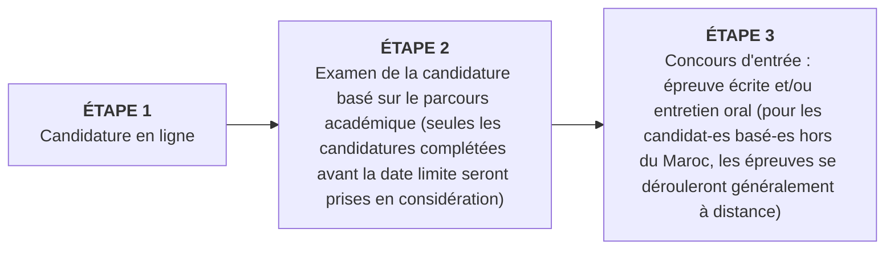
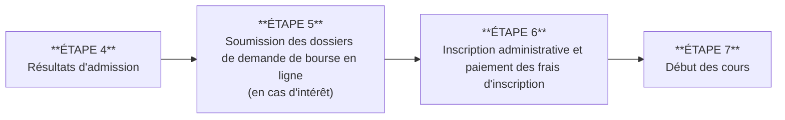

UM6P
University Mohammed VI Polytechnic
Année Académique 2025 - 2026

Three students, two men and one woman, are sitting on a bench and talking. In the background, there is a large, golden, geometric wireframe sculpture.

# Transforming potential into impact
## Offre Globale de Formations

Empowering Minds.
1

# À propos de l’UM6P

## BIENVENUE DANS L’UNIVERS UM6P : UN MODÈLE D’EXCELLENCE EN PLEINE EXPANSION

Université jeune et ambitieuse située au Maroc et profondément ancrée dans des valeurs nobles telles que l’éthique, l’inclusion, la durabilité et l’engagement communautaire, nous proposons à nos étudiant-es un large éventail de programmes de haut niveau (cycles ingénieurs, licences, masters, doctorats, …) dans des domaines aussi variés que les sciences et technologies, l’ingénierie, la santé, le business et le management, l’économie, et les sciences sociales.

En pleine expansion, notre institution aspire à figurer parmi les plus grandes références internationales à court terme, grâce à notre recherche et notre enseignement de classe mondiale.

Quels que soient votre nationalité, votre domaine d’études ou vos ambitions professionnelles, sachez que vous êtes les bienvenu-es au sein de notre communauté. Nous serons à vos côtés tout au long de votre parcours académique pour vous accompagner dans l’élargissement de vos horizons et la concrétisation de vos rêves.

The image shows a modern architectural structure with terracotta-colored walls. The building features a large rectangular opening or gateway and numerous small, square windows arranged in a grid pattern. The sky is blue with some light clouds, and there is a green lawn in the foreground.

## UNE UNIVERSITÉ UNIQUE

Incubée par un groupe industriel, et fondée en tant qu’université à but non lucratif à Benguerir, au nord de Marrakech, l’UM6P a vu le jour en 2013 avec la création de Emines, l’Ecole de Management Industriel. D’autres écoles ont rapidement été créées, notamment après l’inauguration officielle par Sa Majesté le Roi Mohammed VI en 2017.

Aujourd’hui, l’UM6P se positionne comme une université de recherche appliquée de plus en plus reconnue à l’échelle internationale. Forte d’un corps professoral d’exception, d’installations de recherche de pointe, de partenariats mondiaux et d’un écosystème entrepreneurial florissant, l’UM6P est un hub innovant qui prépare les étudiant-es pour le «future of work».

Sur nos 2 campus Etudiants (Benguerir et Rabat), nous vous offrons la possibilité de vous immerger dans la culture de recherche dynamique de l’Université, et de rejoindre un environnement stimulant où vous pourrez apprendre auprès de chercheurs de renommée mondiale, à la pointe de leur discipline.

Vous bénéficierez également d’un ensemble complet de services d’appui aux étudiant-es et d’une grande variété d’activités parascolaires pour une expérience étudiante riche et épanouissante.

Plus qu’une institution académique traditionnelle, l’UM6P est une plateforme d’expérimentation et une source d’opportunités que les étudiant-es aiment appeler «l’école de la vie». Elle est le reflet du monde extérieur, avec ses défis, ses perspectives et ses promesses, et elle s’efforce de révéler le potentiel de la jeunesse marocaine, continentale et internationale.

2

# Faites le choix d’une université où l’éducation rime avec innovation.

Three students—a woman and two men—are sitting together on a green lawn, smiling and looking at a laptop screen. They are wearing white t-shirts with the UM6P (Université Mohammed VI Polytechnique) logo. In the background, there is a large, modern terracotta-colored building with a grid of small square windows under a clear blue sky.

3

# L'UM6P en Chiffres

## Éducation

* **>7.200** Étudiant-es
* **2** Campus Étudiants (Rabat et Benguerir)
* **17** Facultés & Écoles
* **42** Programmes Académiques
* **55%** Étudiantes*
* **10%** Étudiants internationaux*
* **40** Nationalités*
* **6** Coding Schools

\* Programmes conventionnels

The page is illustrated with several photographs:
- A photograph of two students, a woman wearing a hijab and a man, conversing in an outdoor campus setting.
- Three photographs showing modern university buildings at night, featuring architectural lighting and reflections in water.

4

# Innovation & Entrepreneuriat

* **+30** Programmes de soutien à l'entrepreneuriat
* **>150** Startups créées
* **>21K** Personnes impactées
* **>800** Porteurs de projets et startups soutenues

Two men are leaning over a table covered with colorful sticky notes, engaged in a collaborative discussion. In the background, another person is partially visible.

# Recherche

* **5.226** Publications scientifiques (depuis 2017)
* **>280** Professeurs permanents
* **25** Pays impliqués
* **>995** Doctorants
* **~300** Projets de recherche
* **>126** Partenariats de recherche

A researcher wearing a white lab coat, safety goggles, and gloves is carefully weighing a substance on a precision scale in a laboratory setting. On the table, there is a bottle with a label that includes "CBS ICN".

5

# Notre promesse en 5 points

L'image montre un intérieur architectural moderne avec des murs de couleur ocre-rouge et un escalier central éclairé par une lumière jaune.

## #1 PROPOSER UNE PÉDAGOGIE EN RUPTURE AVEC LES MÉTHODES TRADITIONNELLES

Brisant les codes de l’enseignement traditionnel, l’UM6P propose des approches innovantes de l’apprentissage.

L’UM6P prône ainsi un apprentissage basé sur l’expérimentation dans ses laboratoires de recherche et ses fablabs équipés des dernières technologies, mais aussi dans ses laboratoires vivants (« LIVING LABS »). Plateformes d’expérimentation grandeur nature (ferme expérimentale, complexe industriel, laboratoire de simulation, Data Center, etc.), ces LIVING LABS vous donnent l’opportunité de forger une expérience terrain indispensable au début de votre carrière.

L’UM6P propose également des classes virtuelles et des cours en ligne développés par l’université et ses partenaires. Pour aller encore plus loin, nous introduisons la gamification et l’apprentissage entre pairs en tant que nouvelles méthodes pédagogiques, par exemple à l’école de coding 1337.

L'image montre une vue en plongée d'une grande foule de personnes assises dans un auditorium lors d'un événement, avec des confettis blancs tombant du plafond.

## #2 PRÉPARER NOS ÉTUDIANT-ES POUR LE MONDE PROFESSIONNEL RÉEL

Etroitement liée à l’industrie par essence, l’UM6P représente un pont entre l’académique et le business. En tant qu’étudiant-e, vous bénéficierez de liens étroits et constants avec le monde des affaires : études de cas et projets d’application, visites de terrain, immersion dans des living labs, stages, rencontres régulières avec les entreprises dans le cadre de l’agenda du Career Center, etc.

Pour ceux d’entre vous qui s’intéressent à l’entrepreneuriat, voire qui portent déjà un projet et souhaitent créer leur propre entreprise, un écosystème entrepreneurial mature, animé par la Direction Entrepreneurship & Venturing, est à votre disposition pour vous accompagner à chaque étape de votre projet : de l’idéation à l’accélération en passant par l’incubation, jusqu’au financement éventuel.

6

A photograph at the top left of the page shows a large audience seated in an auditorium. Many of the attendees are wearing blue sashes over their shoulders. In the front row, several men in formal suits are seated. Some of the seats have "RÉSERVÉE" labels attached to them.

# #4 METTRE À DISPOSITION DES ÉTUDIANT-ES UNE LARGE GAMME DE SERVICES

Une gamme complète de services aux étudiant-es vous soutiennent tout au long de votre parcours, y compris des services spécifiquement dédiés aux étudiant-es internationaux.

Au-delà de l’accompagnement de proximité du corps académique, animé par l’envie de partager ses connaissances et expériences et de vous aider à développer votre plein potentiel, plusieurs équipes sont à vos côtés tout au long de votre parcours à l’UM6P : Orientation à l’arrivée (Admission) ; Santé et bien-être (Health Center), Maîtrise des Langues (Language Center), Employabilité (Career Center, SCALES), Accompagnement des étudiant-es internationaux (International Student Club ; Student Country Ambassadors), Sécurité sur campus (Facility Management), Culture générale (Learning Center; Open Minds), ...

# #3 OFFRIR UNE EXPÉRIENCE ÉTUDIANTE RICHE ET ÉPANOUISSANTE

Diverses activités extracurriculaires vous permettent de vous constituer un réseau, de développer de nouvelles compétences, de relever des défis ou encore de vous impliquer dans des initiatives sociales.

Rejoignez l’un des nombreux clubs étudiants de l’UM6P (UM6P Band, Alchimia, Cyborg, Enactus, Rotaract, ...), pratiquez un sport, y compris à un niveau de compétition (Pôle Sport), participez à des initiatives citoyennes (Social Experience Program), devenez ambassadeur du développement durable (Sustainable Development), ou encore rejoignez les bancs de la chorale UM6P... Le choix est entre vos mains...

# #5 DONNER LA CHANCE À TOUTE ÉTUDIANT-E BRILLANTE DE POURSUIVRE DES ÉTUDES DE QUALITÉ

En phase avec son engagement citoyen et son orientation vers l’excellence, l’UM6P permet à tout étudiant-e brillant-e, quelle que soit son origine (sociale, genre, nationalité), d’accéder à des études de qualité, via un dispositif attractif de bourses d’études et de vie.

Ce dispositif bénéficie à une large majorité de nos étudiant-es.

An orange square graphic is located at the bottom right of the page.

7

# Programmes académiques sur campus

## Le Pôle Science & Technologie

Le Pôle Science & Technologie se positionne en recherche, innovation et éducation sur des domaines scientifiques et technologiques clés afin de proposer des solutions africaines aux grands enjeux mondiaux. Ce pôle abrite un grand nombre d’écoles et propose une large gamme de programmes académiques innovants et interdisciplinaires portant sur des sujets de pointe, étroitement liés à l’activité de recherche des laboratoires UM6P. Ces programmes garantissent une solide formation scientifique et technologique tout en assurant l’inclusion sociétale des avancées scientifiques. Ils visent à vous préparer à relever les défis du monde contemporain.

### Établissements :

* School of Industrial Management / EMINES
* UM6P School of Computer Science – College of Computing / CC
* Ecole d’ingénieur en Génie Chimique, Minéralogique et Biotechnologique / GUP + IST&I
* Ecole des Sciences de l’Agriculture, de la Fertilisation et de l’Environnement / ESAFE
* Green Tech Institute / GTI
* School of Architecture, Planning & Design / SAP+D
* Centre d’Etudes Doctorales / CEDOC
* Ecoles de Coding / 1337 & Youcode

### Programmes Post Bac

* Cycle Préparatoire Intégré au Cycle Ingénieur en Management Industriel / EMINES
* Cycle Préparatoire Intégré au Cycle Ingénieur en Computer Science / CC
* Cycle Préparatoire Intégré au Cycle Ingénieur en Génie Chimique, Minéralogique et Biotechnologique / GUP + IST&I
* Diplôme Architecte (Bac+6) / SAP+D
* Cycle Préparatoire Intégré au Cycle Ingénieur en Agriculture / ESAFE*
* Bachelor of Science in Applied Sciences and Business* (100% Anglais)

### Cycles Ingénieur

* Cycle Ingénieur en Management Industriel / EMINES
* Cycle Ingénieur en Computer Science / CC
* Cycle Ingénieur appliquée / IST&I*

### Programmes Master

* Master en Ingénierie Electrique pour les Energies Renouvelables et les Réseaux Intelligents / GTI
* Master en Technologies Industrielles pour l’Usine du Futur / GTI
* Master en Ingénierie des Bâtiments Verts et Efficacité Energétique / SAP+D

### Programme Doctoral

* Science, Technology and Engineering / CEDOC

### Programmes Spécifiques

* Programmes de coding / 1337 & YouCode
* Preparation Education Fellow / EMINES
* Master of Engineering in Materials, Energy and Entrepreneurship / MSN (Département Science des Matériaux et Nano-ingénierie) (100% anglais)
* Programme Step-Up / Mahir Center

\*Programmes en cours d’accréditation

8

# Le Pôle Santé

A medical student in a white coat and stethoscope is performing a clinical simulation on a mannequin in a hospital bed. Another person's hand in a white glove is pointing towards something in the background.

### Établissements :
* Faculty of Medical Sciences / FMS
* Institut Supérieur des Sciences Biologiques et Paramédicales / ISSB-P

### Programmes Post Bac :
* Doctorate in Medicine / FMS (100% Anglais)
* Doctorate in Pharmacy / FMS (100% Anglais)
* Licence Soins Infirmiers, option Infirmier Polyvalent / ISSB-P

Lancé plus récemment, le Pôle Santé a pour mission de créer un écosystème de santé combinant des activités académiques, de la recherche scientifique et des services de santé grâce au projet de la Smart Health Care City de Benguerir. Le pôle s’engage à développer des programmes de formations médicale et paramédicale de haute qualité en réponse aux enjeux de santé actuels et futurs, ainsi qu’aux évolutions technologiques dans les pratiques médicales et paramédicales. L’approche pédagogique repose sur la simulation clinique, l’analyse réflexive et l’évaluation des pratiques professionnelles.

Composé d’un Centre Hospitalier Universitaire, d’un Centre de Rééducation et d’un Hôpital Gériatrique, le projet Smart Health Care City est actuellement en construction et devrait ouvrir ses portes au public début de 2025.

9

# Le Pôle Sciences Sociales, Economie & Humanités

Le Pôle Sciences Sociales, Economie & Humanités, représenté par la Faculté de Gouvernance, Sciences Economiques et Sociales (FGSES) propose des formations en sciences humaines et sociales axées sur les politiques publiques et sur les questions spécifiques qu’elles soulèvent pour le pays et, plus largement, pour le continent africain dans son ensemble. Alliant les savoirs classiques et les connaissances académiques les plus récentes, ces formations déclinent l’ensemble formé par les sciences sociales, l’économie et les humanités en quatre grandes filières qui délivrent des diplômes de Licences, de Masters et de Doctorats.

## Établissements
* Faculté de Gouvernance, Sciences Economiques et Sociales / FGSES
* Centre d’Etudes Doctorales / CEDOC

## Programmes Post Bac
* Licence en Économie Appliquée / FGSES
* Licence en Science Politique / FGSES
* Licence en Sciences Comportementales pour les Politiques Publiques / FGSES
* Licence en Relations Internationales / FGSES
* Licence en Droit Public / FGSES

## Programmes Master
* Master Behavioral and Social Sciences for Public Policy / FGSES
* Master Global Affairs / FGSES
* Master Political Science / FGSES
* Master Analyse Economique et Politiques Publiques / FGSES
* Master Economie Quantitative / FGSES

## Programmes Doctoraux
* Economics / CEDOC
* Political Science and Global Studies / CEDOC
* Behavioral and Social Sciences / CEDOC

10

# Le Pôle Business & Management

En étroite collaboration avec des universités renommées à travers le monde, le Pôle Business & Management de l’UM6P prépare la prochaine génération de leaders et entrepreneurs africains socialement responsables et capables d’agir dans des contextes d’incertitude et de complexité. Empathiques, dotés d’une intelligence relationnelle et d’un esprit critique, ces leaders favorisent les environnements créatifs et innovants.

Le pôle propose un portefeuille de programmes couvrant un large éventail de sujets, notamment l’Hospitalité, le Management International, l’Agrobusiness, l’Intelligence Collective, et bien d’autres.

Two young men in professional business attire are walking and conversing outdoors on a modern university campus with red-toned buildings and a large, geometric canopy structure in the background.

## Établissements

* Africa Business School / ABS
* School of Collective Intelligence / SCI-ABS
* School of Hospitality, Business & Management / SHBM-ABS (Membre certifié du réseau des écoles certifiées de l’EHL)
* Centre d’Etudes Doctorales / CEDOC

## Programme Post Bac

* Bachelor Hospitality Business and Management / SHBM (100% Anglais)

## Programmes Master

* Master Collective Intelligence / SCI (100% Anglais)
* Master AgriBusiness Innovation / ABS (100% Anglais)
* Master International Management / ABS (100% Anglais)
* Master Financial Engineering / ABS (100% Anglais)

## Programme Doctoral

* Management and Organizational Sciences / CEDOC

## Programme Specifique

* Programme Mahir Center

11

# Le processus d’admission pas à pas

Prenez le temps de comprendre le processus d’admission, de la soumission de votre candidature aux concours d’entrée puis au dépôt éventuel de votre demande de bourse. Restez surtout attentifs aux dates limites d’admission de chaque programme.

Nos équipes d’admission sont là pour vous accompagner tout au long du processus, y compris pour vous orienter dans le choix des programmes.

## Processus de Candidature

Après avoir vérifié que vous répondez à toutes les exigences du(des) programme(s) et préparé les documents justificatifs nécessaires, les étapes seront les suivantes :

**Documents nécessaires pour candidater :**

* Photos d’identité
* Carte Nationale d’Identité / Passeport
* Copie de tous les diplômes ou certificats obtenus
* Relevés de notes officiels
* Lettre de motivation (selon les programmes)
* Curriculum Vitae (uniquement pour les candidats aux Masters)

Nous vous invitons à consulter les détails sur le processus de candidature (y compris les plateformes de candidature, les dates limites, les documents requis, ...), sur notre page :

https://um6p.ma/admissions

12

# Un Processus d'Admission Hautement Sélectif pour Recruter les Meilleurs Étudiants

Notre processus d'admission est rigoureusement sélectif, conçu pour identifier et recruter les étudiants les plus talentueux et prometteurs. Chaque année, nous avons le privilège d'accueillir une cohorte d'étudiant-es exceptionnel-les qui apportent leur passion, leur détermination et leur désir d'excellence dans notre communauté universitaire.

## +3 000 Étudiant-es Admis pour l'Année Académique 2024-25

Nous avons admis +3000 étudiant-es, sur un total de +150 000 candidatures complètes reçues. Ces chiffres témoignent de la notoriété croissante de l'UM6P et du fort attrait qu'exerce notre institution en tant que choix éducatif de premier plan.

Cette sélection rigoureuse est un témoignage de la qualité de nos programmes académiques, de notre engagement envers l'éducation de classe mondiale et de notre conviction que nos étudiant-es sont la clé de l'avenir, prêt-es à relever les défis de demain avec succès. Nous sommes fiers d'accueillir ces futur-es leaders, innovateurs, entrepreneurs au sein de notre communauté universitaire et sommes impatients de les voir réaliser leur plein potentiel.

13

# Quel budget prévoir ?

Prenez le temps de comprendre tous les coûts impliqués et les possibilités de subventions.

Calculez le coût total de vos études, y compris les frais d’inscription et de scolarité, les frais de vie, les frais de demande de visa et les billets d’avion (le cas échéant), les dépenses personnelles liées aux études et un budget d’urgence minimal.

## Frais d’inscription

Pour la majorité de nos programmes, les frais d’inscription ne sont dûs qu’une seule fois la première année afin de garantir l’inscription. Cependant, certaines écoles ont des processus spécifiques ; nous vous invitons à les consulter.

## Frais de scolarité et frais de vie
(pour un hébergement et une restauration sur le campus)

A photograph shows two students, a woman with curly hair and glasses sitting at a computer and a man with a beard and glasses standing behind her, both looking at a computer screen in a lab setting.

<table>
  <thead>
    <tr>
        <th>Intitulé du Programme</th>
        <th>Durée</th>
        <th>Frais d'inscription (MAD)</th>
        <th>Frais de Scolarité annuels (MAD)</th>
        <th>Frais d'hébergement mensuels (MAD)</th>
        <th>Frais de restauration mensuels (MAD) estimation</th>
        <th></th>
    </tr>
  </thead>
  <tbody>
    <tr>
        <td>Diplôme Architecte</td>
        <td>6 ans</td>
        <td rowspan="5">5 000</td>
        <td>80 000</td>
        <td rowspan="5">Entre 1 000 et 2 300 en fonction du campus</td>
        <td rowspan="5">1 800</td>
        <td></td>
    </tr>
    <tr>
        <td>Doctorat Médecine/ Pharmacie</td>
        <td>6 ans</td>
        <td>130 000</td>
        <td></td>
    </tr>
    <tr>
        <td>(Cycle Préparatoire Intégré) + Cycle Ingénieur</td>
        <td>(2) + 3 ans</td>
        <td>75 000</td>
        <td></td>
    </tr>
    <tr>
        <td>Licence - Bachelor</td>
        <td>3-4 ans</td>
        <td>Entre 45 000 et 80 000</td>
        <td></td>
    </tr>
    <tr>
        <td>Master</td>
        <td>2 ans</td>
        <td>75 000</td>
        <td></td>
    </tr>
  </tbody>
</table>

14

# Un dispositif de bourse très attractif

Portée par des valeurs civiques et convaincus qu’une jeunesse formée et éveillée est une nécessité pour construire un avenir radieux pour l’Afrique de demain, l’Université Mohammed VI Polytechnique - par le biais de sa fondation (la Fondation Ibn Rochd pour les Sciences et l’Innovation - FIRSI) - soutient un grand nombre d’étudiant-es prometteur-euses, engagé-es dans des études de haut niveau et dépourvu-es des ressources personnelles suffisantes et nécessaires, en proposant un programme de bourses attrayant.

L’objectif de ce programme de Bourses est d’offrir une chance à tout-e étudiant-e brillant-e de poursuivre des études universitaires pertinentes, quel que soit sa nationalité, son pays d’origine, son milieu socio-économique ou son genre...

Les bourses sur critères sociaux correspondent à une bourse partielle ou totale couvrant les frais de scolarité et les frais de vie à l’UM6P. Les étudiant-es peuvent postuler en soumettant une demande accompagnée de documents justificatifs. Cette demande est évaluée en fonction d’une série de critères sociaux.

**Nous croyons fermement que l’éducation ne devrait pas être limitée par des obstacles financiers, et nous nous engageons à offrir des opportunités éducatives équitables à toutes celle et tous ceux qui aspirent à l’excellence académique.**

15

**UM6P - Rabat Campus**
Rocade Rabat-Salé,
Technopolis, Rabat 1103
Maroc

**UM6P - Benguerir Campus**
Lot 660, Hay Moulay
Rachid 43 150, Benguerir
Maroc

Hotline Admission:
**+212 (0) 662 324983**
**Admission@um6p.ma**

Direction des Services Académiques
**www.um6p.ma**

16